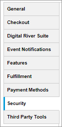
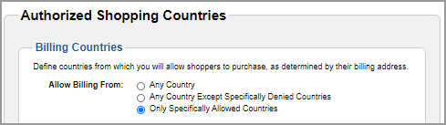
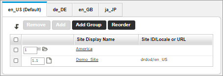
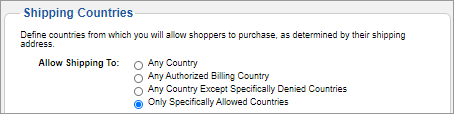
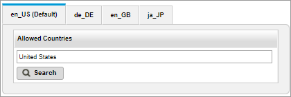
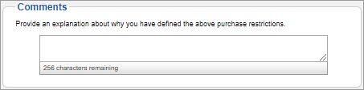

# Configuring authorized shipping and billing countries

1. Sign in to [Global Commerce](https://gc.digitalriver.com/gc/ent/login.do).
2. Select **Administration**, select **Site**, and then click **Configure Site Settings**. The Configure Site Settings page appears.
3. Click the **Security** tab.\
   &#x20;&#x20;
4. Choose the [**Allow Billing From**](../../general-resources/admin-apis-reference/sites/authorized-shipping-and-billing-countries.md#billing-countries) option you want to use to define purchase restrictions based on the shopper's billing address.\
   &#x20;
5. Depending on the option you selected in the previous step, you can add allowed countries to your store's [supported locales](../../general-resources/admin-apis-reference/sites/authorized-shipping-and-billing-countries.md#locales). Supported locales (all other locales besides the default locale) will inherit the settings from the default locale by default.\
   \
   To configure a supported locale differently from the default locale:
   1. Select the locale tab that you want to modify.
   2. Select the **Customize** for **This Locale option**.
   3. Click **Search**  and type the name of the country in the **Search** field.
   4. Click one or more countries in the **Search Results** list to move them to the Selected Items list and then click **Apply**. The countries appear in the **Allowed Countries** list for the selected locale.\
      &#x20;
6. Choose the [**Allow Shipping To**](../../general-resources/admin-apis-reference/sites/authorized-shipping-and-billing-countries.md#shipping-countries) option you want to use to define purchase restrictions based on the shopper's shipping address under **Shipping Countries**. See the Authorized Shopping Countries under the [Security tab](configuring-authorized-shipping-and-billing-countries.md#security-tab) for a description of the fields.\
   &#x20;
7. Depending on the option you selected in the previous step, you can add the countries you can add denied countries to your store's [supported locales](../../general-resources/admin-apis-reference/sites/authorized-shipping-and-billing-countries.md#locales). Supported locales (all other locales besides the default locale) will inherit the settings from the default locale by default.\
   \
   To configure a supported locale differently from the default locale:
   1. Select the locale tab that you want to modify.
   2. Select the Customize for **This Locale** option.
   3. Click **Search**  and type the name of the country in the **Search** field.
   4. Click one or more countries in the **Search Results** list to move them to the Selected Items list and then click **Apply**. The countries appear in the **Denied Countries** list for the selected locale.\
      &#x20;
8. Explain why you defined the restrictions in the [**Comments** ](../../general-resources/admin-apis-reference/sites/authorized-shipping-and-billing-countries.md#comments)field. Provide enough detail to ensure someone else can determine why you denied or allowed billing or shipping to a specific country for a specific locale.

