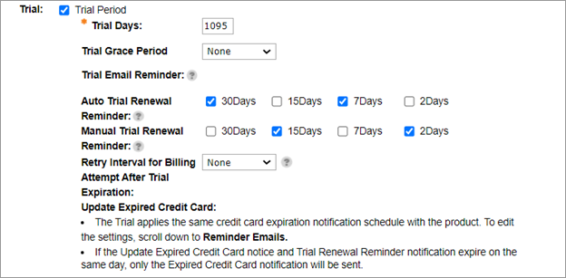

# Setting up subscription renewal reminders

When you [create ](https://help.digitalriver.com/help/gc/Products/All-Products/Creating-a-product.htm)or [edit a subscription product](https://help.digitalriver.com/help/gc/Products/All-Products/Editing-a-product.htm) in [Global Commerce](https://gc.digitalriver.com/gc/ent/login.do), you can configure the renewal reminder notifications associated with the subscription product. The following instructions focus on how to edit the email notifications for an existing subscription product in Global Commerce.

1. Sign in to [Global Commerce](https://gc.digitalriver.com/gc/ent/login.do).
2. Select **Catalog**, **Products**, and click **Manage Products**. The Products page appears.
3. Complete the search fields under the Search tab and then click **Search**  to locate the specific products. The results appear in the Products list.
4. Click the subscription product's link under the **Internal Product Name** column. The Edit Product page appears.
5. Click the **Details** tab.
6. Scroll down to **Subscription**. \
   &#x20;
7. Under **Reminder Emails** in the **Notifications** pane, set up the reminders:&#x20;
   * If you want to send automatic renewal reminders, select one or more of the following checkboxes for **Reminder for Automatic Renewals**: **90 Days**, **30 Days**, **15 Days**, and **7 Days**.
   * If you want to use a different schedule for manual renewal reminders, select the **Use a different schedule for manual renewal reminders** checkbox, and select one or more one or more of the following checkboxes for **Reminder for Manual Renewals**: **90 Days**, **30 Days**, **15 Days**, **7 Days**, or **No Reminders**.
   * If you want to send a reminder when a shopper's credit card has expired, select one or more of the following checkboxes for **Updated Expired Credit Card**: **30 Days**, **15 Days**, and **7 Days**. If the Update Expired Credit Card notification and Renewal Reminder notification are both scheduled for delivery on the same date and the shopper credit card has expired, only the Expired Credit Card notification will be sent.\
     .png>)
8. Click **Save**.
