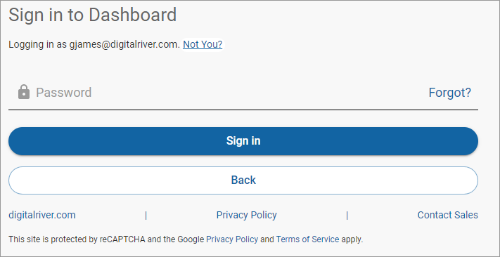
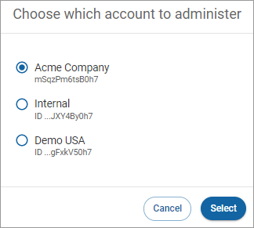

# Digital River Dashboard

You can create and access your account in six easy steps.

1. [Creating a free test account](quick-start-guide.md#step-1-creating-a-free-test-account)
2. [Activate your account](quick-start-guide.md#step-2-activate-your-account)
3. [Complete your sign up](quick-start-guide.md#step-3-complete-your-sign-up)
4. [Sign in to Digital River Dashboard](quick-start-guide.md#step-4-sign-in-to-dashboard)
5. [Choose an account](quick-start-guide.md#step-5-choose-an-account)
6. [Review or edit profile settings](quick-start-guide.md#step-6-review-or-edit-profile-settings)

## Step 1: Creating a free test account

To create your free test account, follow these steps:

1. Go to [https://dashboard.digitalriver.com/signup](https://dashboard.digitalriver.com/signup).
2. Complete the fields in the form.\
   \

3. Click **Try it out for free**. You'll see a message that the account is created and receive an activation email.
4. In the email message, click the **Activate your account** link to open a dialog box. Enter the requested information and click **Complete account activation**.\
   \
   .png>)

## Step 2: Activate your account

After Digital River provisions your account, you receive an activation email. Click the **Activate your account** link to open a dialog box. Enter the requested password information and click **Complete account activation**.

.png>)

## Step 3: Complete your sign up

Set up your password as requested to complete your sign up. Click **Complete account activation**.&#x20;

If you [forget your password](reset-your-password.md) later on, you can add a mobile phone number to your **Profile settings.** This lets you have a password reset request sent to your phone. This should be done after you complete your initial sign-up.\
\
.png>)


On activation of a new Dashboard account, it may take up to two business days for all payment methods to be available for use. The payment methods available on a new test account will include all those marked as supported in the [test environment](../../developer-resources/testing-scenarios.md) as noted in [Supported payment methods](../../payments/payment-integrations-1/drop-in/#supported-payment-methods).


## Step 4: Sign in to Digital River Dashboard

To sign in to [Dashboard](https://dashboard.digitalriver.com/login), enter your email address and click **Next**. Confirm the email address you are using is correct. If it's not, click **Not you**, enter your email address in the field and click **Next** to return to the Login screen.

Enter your password and click **Sign in**.

## Step 5: Choose an account

You will be directed to the landing page for your account once you sign in (your landing page is determined by your assigned role, such as User Manager or Finance Manager; see [Account Access](account/account-access.md)). If you have access to multiple accounts (see [Account](account/) for more information), you must choose an account to administer and click **Select**.

## Step 6: Review or edit profile settings

View and manage your [Profile settings](profile-settings/viewing-your-personal-information.md#profile-settings) by clicking your name in the upper-right corner to open a dropdown menu.

Click **Profile settings**. The settings that you can edit include [changing your password](profile-settings/changing-your-password.md), [updating your account recovery trusted phone number](profile-settings/updating-your-phone-number.md), and [enabling multi-factor authentication](profile-settings/enabling-two-factor-authentication.md).


**Note:** The Digital River Dashboard application provides multifactor authentication (MFA) to ensure maximum security. Choose your phone number or Google Authenticator [to set up MFA](profile-settings/enabling-two-factor-authentication.md). If you are using both Digital River Dashboard and eCompass, you are required to set up MFA for both applications. Use the same username and password for both applications, so you only need to set up MFA once. Your credentials are applied to both applications in the same way.

