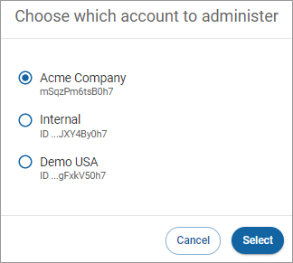

# Switching accounts

If you have multiple accounts, you will have the option to switch between them. To switch accounts:

1. Under **Account,** click the name of the account you're using to open a dropdown list and click **Switch account**.\
    (3) (3) (3) (3) (1) (3) (4).png>)
2. Choose the account you want to administer and click **Select**.\
   
