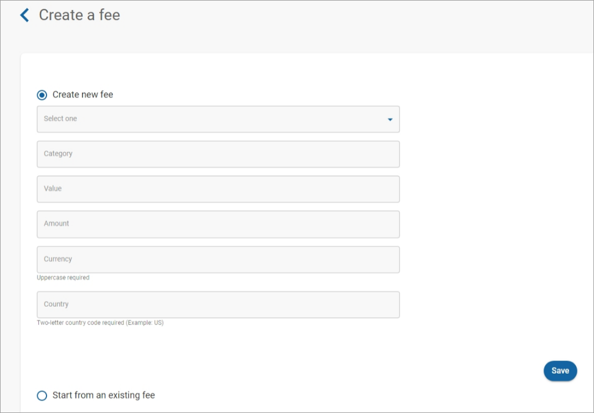
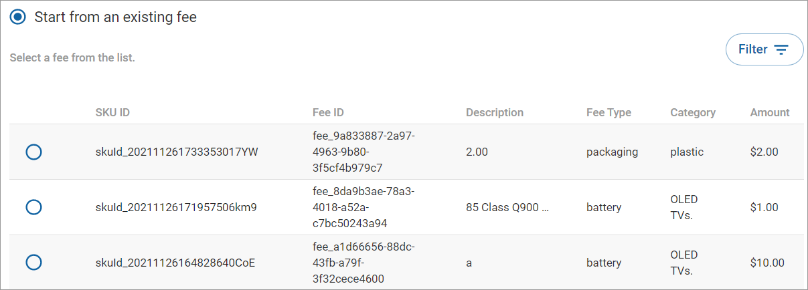

# Adding a fee to a SKU

To add a [fee](../../../../product-management/regulatory-fees/) to a SKU:

1. Click **SKUs** in the left navigation. The SKUs page appears.
2. To add a fee to a SKU, [search](searching-for-skus.md) or scroll to find the SKU you want to have a fee.
3. Click the order ID link under the **ID** column. The SKU details page appears.
4. Scroll down to **Fees** and click **Add fee**. The Create a fee page appears.
5. Choose one of the following options:
   * **Create new fee:** To create a new fee:
     1. Click **Create fee**.
     2.  Select this option to create a new fee. Complete the fields, and click **Save**.

         
   * **Start from an existing fee:** Select this option to create a new fee from an existing fee.
     1. Click **Start from an existing fee**.
     2.  Select the fee you want to use as the basis for the new fee. To search for a specific fee, click **Filter**, select the fee type, and click **Apply**.

         
     3. Scroll down to click **Select fee**.
     4. Select the fee type from the **Select one** dropdown. The options are Battery, Weee, Copyright, E\_Waste, and Packaging.
     5. Complete the fields and click **Add to SKU**.\
        .png>)\
        The new few will appear under **Fees** on the SKU details page.

## Fee fields

When you [create a fee](../../../../product-management/regulatory-fees/managing-regulatory-fees.md), provide the following information on the Create a fee and Add Fee to SKU pages. The fields are defined below.

### Select one

Select the [type](../../../../product-management/regulatory-fees/managing-regulatory-fees.md#type) of fee from the dropdown. The options are Battery, Weee, Copyright, E\_Waste, and Packaging.

### Category

Provides the [category](../../../../product-management/regulatory-fees/managing-regulatory-fees.md#category) of the SKU as defined by regulatory law (for example, `3. IT and Telecommunication Equipment`).

### Value

Provides the product type as well as various product attributes (for example,`5" Class Q900 QLED Smart 8K UHD TV`).

### Amount

Provides the amount of the fee being charged in the configured currency.&#x20;

### Currency

Provides the type of currency being used to pay the fee.

### Country

Provides the two-letter [Alpha-2 country code](https://www.iban.com/country-codes) as described in the [ISO 3166](https://www.iso.org/iso-3166-country-codes.html) international standard..

### Additional fee information

Depending on the type of fee you have selected from the Select one dropdown (for example, Battery), you may be required to provide additional information in fields displayed below the Country field. See [Managing regulatory fees](../../../../product-management/regulatory-fees/managing-regulatory-fees.md) for more information.
