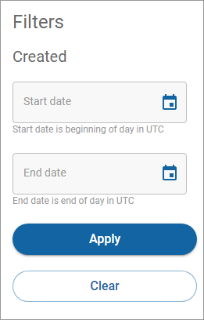

# Filtering your customers

To filter the results on the Customers page:

1. Click **All customers** in the left navigation. The Customers page appears.
2. Click **Filter**. The Filters dialog appears.\
   
3. Complete the **Start date** and **End date** fields for when the customer was created and click **Apply.** The **Filter** button displays how many filters are currently applied. To clear the filter settings, click **Filter** and then click **Clear**. Once you navigate from the page, the default settings are restored.
