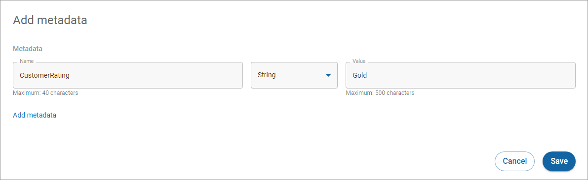

# Editing metadata

To edit metadata:

1. Click **All customers** in the left navigation. The Customers page appears.
2. [Search](../searching-for-customers.md) or scroll to find the customer you want to edit.
3. Click the customer ID link under the **Customer** **ID** column. The Customer details page appears.
4. Click **Edit** in the options menu  (icon on the right of the row) in the Metadata section. The Add metadata dialog box appears.\
   
5. Enter the information you want to change and click the **Save** button.
6. A green **Changes saved** dialog box will appear in the bottom left corner of the screen.
