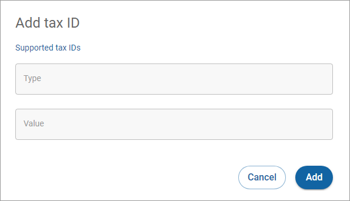

# Adding a tax ID

To add a tax ID to a customer:

1. Click **All customers** in the left navigation. The Customers page appears.
2. [Search](../searching-for-customers.md) or scroll to find the customer you want to edit.
3. Click the customer ID link under the **Customer** **ID** column. The Customer details page appears.
4. Click the **Add tax ID** button in the Tax section. If a tax ID already exists, click the **Add tax ID** link under the existing ID. The Add tax ID dialog box appears.\
   
5. Enter the required information and click **Add**.
6. A green **Tax identifier added** dialog box will appear in the bottom left corner of the screen.
