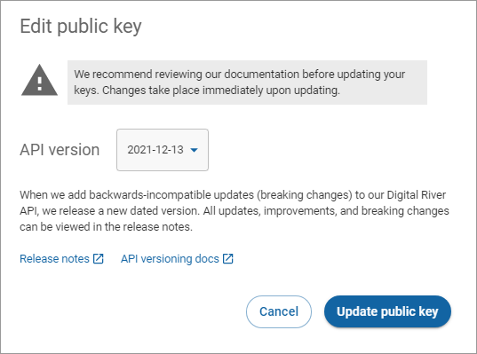

# Changing the API version for your standard key

To update your public and confidential keys:

1. Click **API keys** in the left navigation. The API keys page appears.
2. Click **More options** (vertical ellipses) associated with the standard key you want to update and click **Edit**.\
   
3. Select the version from the **API version** dropdown list.\
   
4. Click **Update public key**.


The key won't be available for immediate use. It takes up to 10 minutes for the key to fully propagate.

