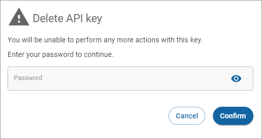

# Deleting a restricted key

To delete a restricted key:

1. Click **API keys** in the left navigation. The API keys page appears.
2. Click **More options** (vertical ellipses) associated with the restricted key you want to delete and click **Delete**.\
    (2) (1) (1).png>)
3. Complete the fields in the **Delete API Key** dialog and click **Confirm**.

