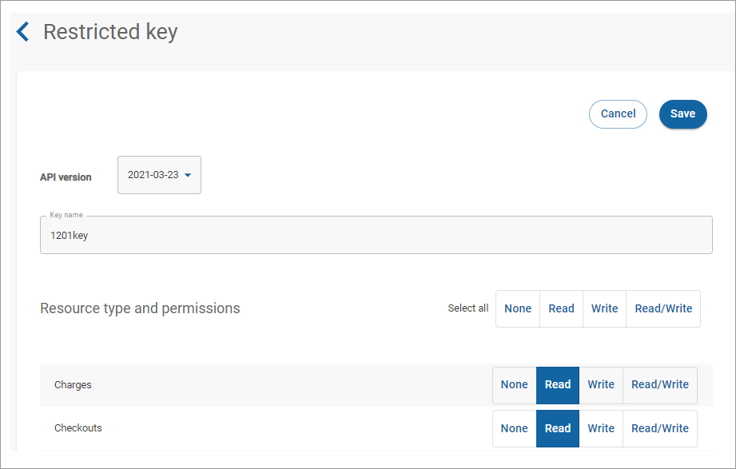

# Editing a restricted key

To edit a restricted key:

1. Click **API keys** in the left navigation. The API keys page appears.
2. Click **More options** (vertical ellipses) associated with the restricted key you want to modify and click **Edit**.\
    (2) (1) (1).png>)
3. Select the version from the **API Version** dropdown list.
4. Edit the name in the **Key name** field.
5. For each resource type, select the appropriate permission. For example, **None**, **Read**, **Write**, or **Read/Write**. At least one permission must be selected.
6. Click **Save**.


The key won't be available for immediate use. It takes up to 10 minutes for the key to fully propagate.


