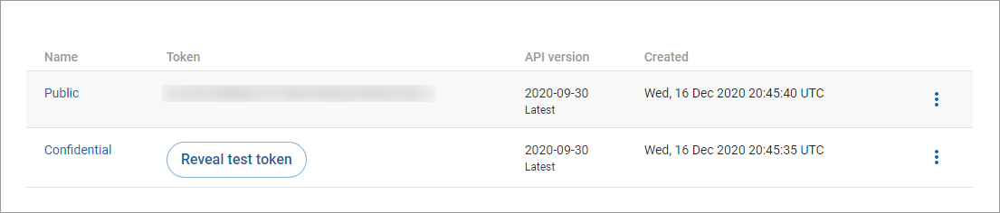
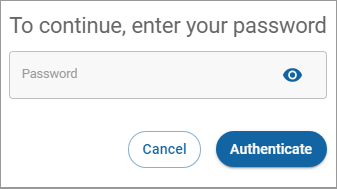

# Getting your API keys


**Prerequisite**: You need to obtain your Digital River API credentials before you can access your keys in the Digital River Dashboard. See [Getting started](../../../../quick-start-guide.md) for instructions.


To get your keys, sign in to the Digital River [Dashboard](https://dashboard.digitalriver.com). The API keys page displays your public key in the **Token** column under **Standard keys**.

To see your confidential (secret) key:

1. Click **Reveal token** or **Reveal test token** next to **Confidential** to open the password dialog box.\
   
2. Provide your password and click **Authenticate**. The **Token** field under **Standard keys** will display the confidential key.
