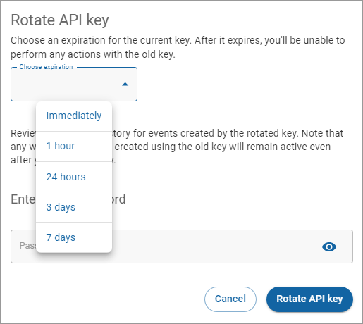

# Rotating keys

You can rotate a standard or restricted API key in your [Digital River Dashboard](https://dashboard.digitalriver.com) if you think an API key is compromised. When you rotate the key, the Dashboard blocks the old key and generates a new one. You can choose to block the old key immediately or allow it to expire after the specified expiration time when you rotate the key. During that specified expiration time, both keys work. It gives you time to make the transition from the old key to the new key. In either case, you can use the new key immediately.


Rotating API keys is a widely accepted best practice recommended by security experts. Rotating API keys makes it easier to track usage and detect any suspicious activity. **By rotating your API keys regularly**, you can ensure the security and protection of your sensitive information and resources.


To rotate a key:

1. From the **API keys** page on the [Dashboard](https://dashboard.digitalriver.com), click **More options** (vertical ellipses) associated with the key you want to rotate and click **Rotate**.\
    (2) (2).png>)
2. Choose the expiration time from the **Choose expiration** list. \
   
3. Complete the fields and click **Rotate API Key**. The Restricted Keys table will display the creation date for **Newest Token** and **Expiring Token**, and the expiration date for **Expiring Token**.


The key won't be available for immediate use. It takes up to 10 minutes for the key to fully propagate.


