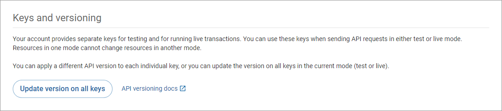
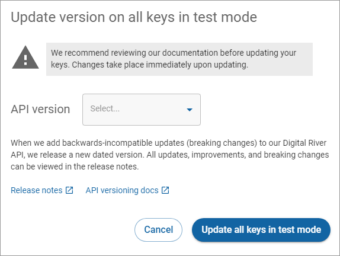

# Updating your API version

## Updating your API version on all keys

Use the **Update version on all keys** button on the Keys and versioning pane to [select a version and update all keys to that version](updating-your-api-version.md). You can select to update all API keys to the latest API version or a previous API version. When you update all keys, the API version column for standard keys and restricted keys displays the version you selected.

1. Select the environment you want to update using the **Test/Production** toggle. **Best Practices**: Install the new version in the [test environment](../../test-and-production-environments.md) first.
2. Click the **Update version on all keys** button to open the Update all keys dialog box.
3. Click the **Release notes** link to review the latest changes. If required, apply the necessary changes to your system before you continue.
4. Select a version from the **API Version** dropdown list and click **Update all keys in test mode** or **Update all keys in production mode.**\
   


The key won't be available for immediate use. It takes up to 10 minutes for the key to fully propagate.


When the update is finished, the Standard and Restricted keys tables display the same API version for each restricted key.

## Release notes

The [Release notes](../../../../general-resources/release-notes/) link takes you to the list of breaking changes in the API. New additions and non-breaking changes don’t need a new API version and will not appear on this list.
