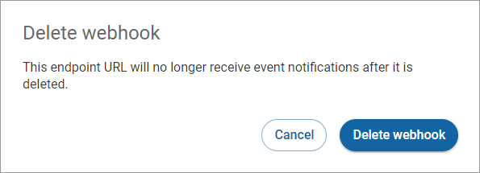

# Deleting a webhook

To delete a webhook:

1. Click **Webhooks** in the left navigation. The Webhooks page appears.
2. Click **More options** (vertical ellipses) associated with the restricted key you want to delete and click **Delete**.\
    (2) (1) (2) (4).png>)
3. Complete the fields in the **Delete webhook** dialog and click **Delete webhook**.

