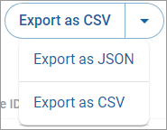

# Exporting your sales summaries

## Export as CSV

To export your sales summaries as CSV:

1. Click **Sales summaries** in the left navigation. The Sales summaries page appears.
2. [Filter your sales summaries](filtering-your-sales-summaries.md), if needed.
3. Click the down arrow .png>) and select **Export as CSV**.\
   
4. Click the **Export as CSV** button (not the arrow).\
   \
   The **Save As** dialog appears.
5. Choose a location and file name to save the file.

## Export as JSON

To export your sales summaries as JSON:

1. Click **Sales summaries** in the left navigation. The Sales summaries page appears.
2. [Filter your sales summaries](filtering-your-sales-summaries.md), if needed.
3. Click the down arrow .png>) and click **Export as JSON**.\
   
4. Click the **Export as JSON** button (not the arrow).\
   \
   The **Save As** dialog appears.
5. Choose a location and file name to save the file.
