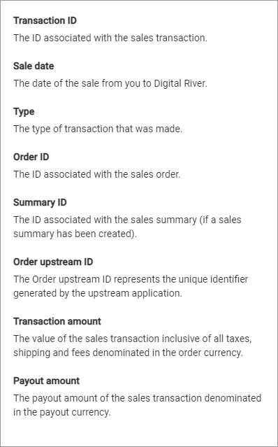

# Transactions

Digital River uses costing to calculate a brand's purchase price per the contract terms for a fulfilled order line item and displays them in the transactions list.

<figure><figcaption></figcaption></figure>

Click the "i" Information icon to open a list of column descriptions.


**Note:** If your application supports the use of metadata, and you want to see it in your transaction data export, we provide metadata support for orders and line items. This metadata is reported in your CSV or JSON export of Transaction information but is NOT visible on the Digital River Dashboard Transactions page.

Your metadata appears in your export file as additional data columns for CSV exports. The metadata columns will use the following labels:

* orderMetadata._your\_key\_value_ – where _your\_key\_value_ is the unique value you assigned to the order metadata. For example, orderMetadata._couponProgram_.
* lineItemMetadata._your\_key\_value_ – where _your\_key\_value_ is the unique value you assigned to the line item metadata. For example, lineItemMetadata._customerID_.


Click the **Refresh** icon to update the list information.
