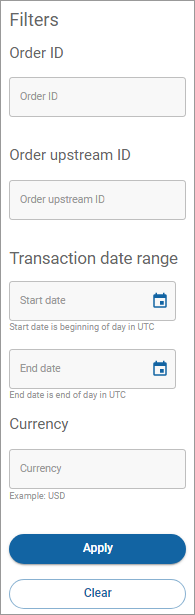

# Filtering your transactions

## Setting your filter parameters

The following table lists the parameters you can define when you filter your transactions.

| Parameter              | Definition                                                                     |
| ---------------------- | ------------------------------------------------------------------------------ |
| Order ID               | The unique identifier of the order.                                            |
| Payee ID               | The unique identifier of the payee.                                            |
| Payee name             | The name of the payee.                                                         |
| Payer ID               | The unique identifier of the payer.                                            |
| Payer name             | The name of the payer.                                                         |
| Transaction date range | The start and end date range for the transaction.                              |
| Currency               | A three-letter alphabetic [ISO currency code](https://www.xe.com/iso4217.php). |

## Filtering your transactions

You can filter the list on the Transactions page to display the information you want to view. To filter the results in the Transactions list:

1. Click **Transactions** in the left navigation. The Transaction page appears.
2.  Click the **Filter** dropdown menu. The Filters dialog appears.

    
3. Complete all or some of the fields and click **Apply**. The **Filter** button displays how many changes you applied to the Filter settings while you are on the page. The Filter settings return to their default settings when you leave the page. To clear the settings on the filter, click **Filter** and then click **Clear**.
