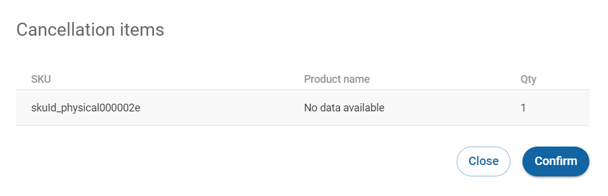

# Cancelling items

From the [Order details](viewing-the-order-details.md) page, you can [cancel a fulfillment order](../../../../integration-options/checkouts/handling-digital-river-coordinated-fulfillments/instructing-digital-to-cancel-items.md#requesting-a-fulfillment-cancellation) either fully or partially. When you cancel an item, the system cancels the relevant part of the payment charge, and initiates a refund.


**​ ​Note:** An order item is either identified by a **SKU ID** or a **Product ID** ([SKU group](../../../../product-management/setting-up-sku-groups.md)) - not both.


To cancel items:

1. Click **Orders** in the left navigation. The Orders page appears.
2. [Filter your orders](filtering-your-orders.md), if needed.
3. Click the order ID link under the **ID** column. The Order details page appears.
4. Click **Cancel items**. The **Create cancellation** page appears.\
   
5. Select the items to cancel and the quantity to cancel.\
   
6. Click **Review and submit.**
7. The Cancellation items dialog box opens for you to review and confirm the cancellation. Click **Confirm**.\
   
8. A green **Cancellation successful** dialog box will appear in the bottom left corner of the screen.
