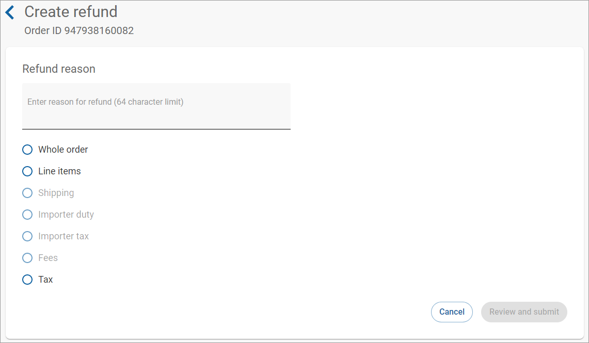
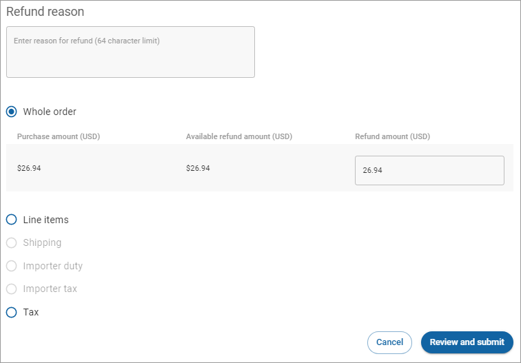
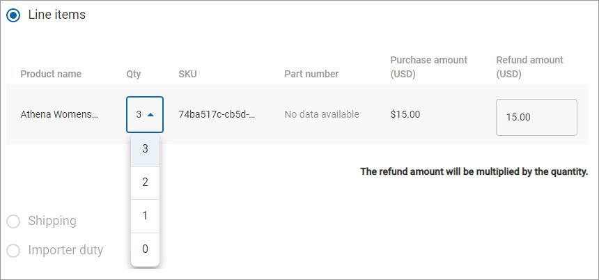

# Creating a refund

To create a refund:

1. Click **Orders** in the left navigation. The Orders page appears.
2. [Filter your orders](filtering-your-orders.md), if needed.
3. Click the order ID link under the **ID** column. The Order details page appears.
4. Scroll down to **Refunds**.
5. Click **Create refund**.\
   
6. Choose the types of refund you want to create. Selecting an option reveals more details about that option.\
   \
   Your options are:
   * **Whole order**–a refund on the whole order
   * **Line items**–choose the specific line items to refund
   * **Shipping**–a refund on shipping
   * **Importer duty**–a refund on the importer duty
   * **Importer tax**–a refund on the importer tax
   * **Fees**–a refund on the fees
   * **Tax**–a refund on the tax&#x20;
7. Enter the amount to refund in the **Refund Amount** field. Note that the amount you can refund the customer is limited to the amount available in the **Available refund amount** field.\
   &#x20;
8. For a **Line items** refund, select the quantity using the **Quantity** dropdown. Note that the **Quantity** multiplies the **Refund amount** to create the refund total. \
   \
   **Note:** For orders with multiple items, select **0** from the dropdown for the item(s) you do not want to refund.&#x20;
9. Review your chosen options and enter any required information. Then click **Review and submit** to process the refund. Note that the amount you can refund the customer is limited to the amount available in the **Available refund amount** field.
10. A confirmation dialog box opens for you to review and submit the refund. Click **Submit**.\
     (3) (1) (1) (2) (3).png>)
11. The refund will appear in the **Refunds** table on the Order details page. \
     (1) (2).png>)
12. Click the link under **Refund ID** to view the details of the refund.\
     (3) (3) (3) (3) (1) (3) (4).png>)
