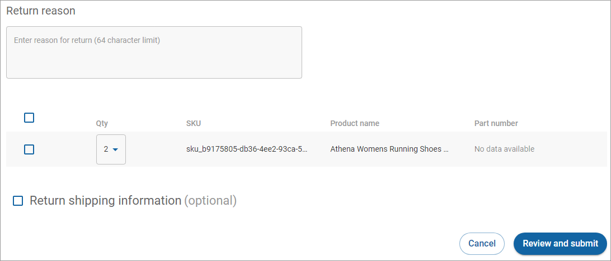
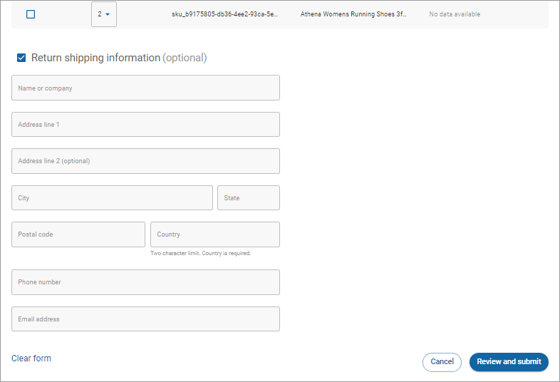

# Creating a return

The **Create return** button only appears when the order status is fulfilled. To create a return:

1. Click **Orders** in the left navigation. The Orders page appears.
2. [Filter your orders](filtering-your-orders.md), if needed.
3. Click the order ID link under the **ID** column. The Order details page appears.
4. Scroll down to **Returns**.
5. Click **Create return**.\
   .png>)
6. Enter the reason for the return (required), select the items to return, and the quantity to return.\
   
7. Select the **Return shipping information** check box if you want to include the address to which the shopper will ship the returned items. The shipping address is optional. However, if you select the **Return shipping information** check box, all the fields are required except for Address line 2.\
   \
   Clearing the **Return shipping information** check box or clicking **Clear form** will not submit any return shipping information.
8. Click **Review and submit** to process the return.\
    (2) (2) (2) (2) (1) (2) (3).png>)
9. Click **Submit**. The return will appear in the Returns table on the Order details page.\
    (2) (2) (2) (2) (1) (2) (3).png>)
10. Click the link under **Return ID** to view the details of the return.\
     (2) (2) (2) (2) (2) (1).png>)
