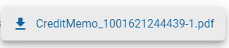
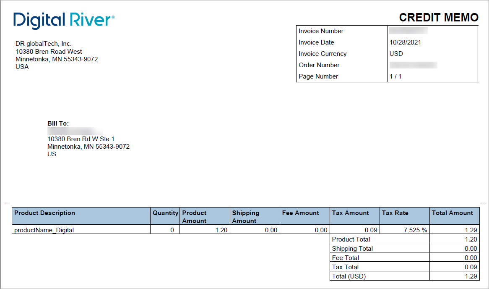

# Downloading a credit memo

### Strengths

* **Clear Procedure:** The document provides a step-by-step procedure that is easy to follow, making it simple for users to understand how to download a credit memo.
* **Direct Language:** Uses direct and clear language which helps in reducing ambiguity and improves user understanding.
* **Structured Format:** The step-by-step list format enhances readability and helps users to follow the instructions more efficiently.

### Weaknesses

* **Assumes User Familiarity:** The document assumes that the user knows how to navigate to the Orders page and filter orders, which might not be the case for all users.
* **Lacks Visuals:** Incorporating screenshots or visual aids could help users better understand each step, especially for those who are more visual learners.
* **Missing Error Handling:** It does not provide any guidance on what to do if the user encounters issues, such as the Download credit memo link not appearing even when a credit memo is available.
* **No Information on File Format:** While it mentions that the file will open in Adobe Acrobat Reader, it does not specify the file format of the downloaded credit memo (PDF, etc.), which could be useful information for the user.

The Download credit memo link is enabled on the Order details page when an order has a credit memo. If no credit memo is available, the link is disabled.

To download a credit memo:

1. Click **Orders** in the left navigation. The Orders page appears.
2. [Filter your orders](filtering-your-orders.md), if needed.
3. Click the order ID link under the **ID** column. The Order details page appears.
4.  To download a credit memo, click the **Download credit memo** link in the upper right corner of the Order details page.\

    <figure><figcaption></figcaption></figure>
5. Click the credit memo you want to download.\
   \
   The file will open in Adobe Acrobat reader.

