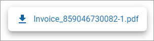
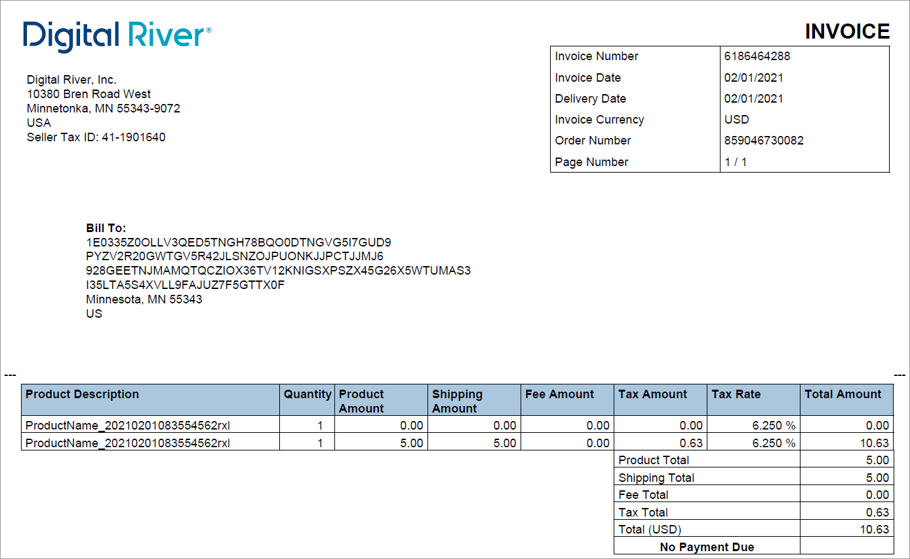

# Downloading an invoice

The Download Invoice link is enabled on the Order details page when an order has an invoice. If no invoice is available, the link is disabled.


If an [order's](https://www.digitalriver.com/docs/digital-river-api-reference/#tag/Orders) `totalAmount` is `0`, then Digital River doesn't generate an invoice for that order.&#x20;


To download an invoice:

1. Click **Orders** in the left navigation. The Orders page appears.
2. [Filter your orders](filtering-your-orders.md), if needed.
3. Click the order ID link under the **ID** column. The Order details page appears.
4.  To download an invoice, click the **Download invoice** link in the upper right corner of the Order details page.\

    <figure><figcaption></figcaption></figure>
5. Click the invoice you want to download.\
   \
   The file will open in Adobe Acrobat reader.

