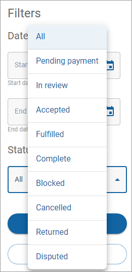

# Filtering your orders

## Setting your filter parameters

The following table lists the parameters you can define when you filter your orders.

| Parameter  | Definition                                                                                                                                                                  |
| ---------- | --------------------------------------------------------------------------------------------------------------------------------------------------------------------------- |
| Date range | The start and end date range for the orders.                                                                                                                                |
| Status     | The status of the order. You can choose from `All`, `Pending Payment`, `In review`, `Accepted`, `Fulfilled`, `Complete`, `Blocked`, `Cancelled`, `Returned`, or `Disputed`. |

## Filtering your orders

To filter the results in the Orders list:

1. Click **Orders** in the left navigation. The Orders page appears.
2. Click **Filter**. The Filters dialog appears.\
   
3. Complete all or some of the fields and click **Apply**. The **Filter** button displays how many changes you applied to the Filter settings while you are on the page. The Filter settings return to their default settings when you leave the page. To clear the settings on the filter, click **Filter** and then click **Clear**.
