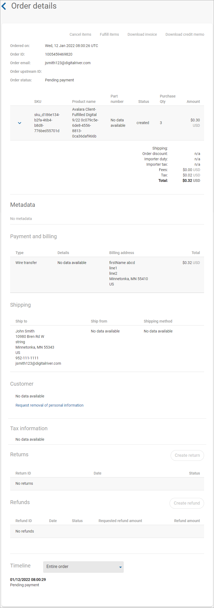
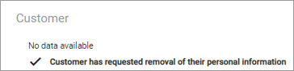

# Recording a customer's request to be forgotten

Due to Digital River's legal and business obligations globally, we need to retain personal data for a defined period. We will remove the personal data once this period expires per our data retention policy.

To record a customer's request to be forgotten:

1. Click **Orders** in the left navigation. The Orders page appears.
2. [Filter your orders](filtering-your-orders.md), if needed.
3. Click the order ID link under the **ID** column. The Order details page appears.
4.  Under Customer, click the **Request removal of personal information** link. The Request removal dialog box opens.

    
5. Click **Confirm**. The Order Details page appears. Note that under the Customer heading, the status now indicates "Customer has requested removal of their personal information." \
   
