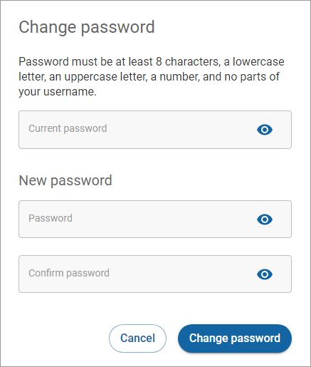

# Changing your password

To change your password, click your user name in the upper-right corner and click **Profile settings** on the dropdown menu to open the Profile settings page. Scroll to the **Account security** section.

Click **Change password**.

Type your new password and retype to confirm your new password, and then click **Change Password**.
