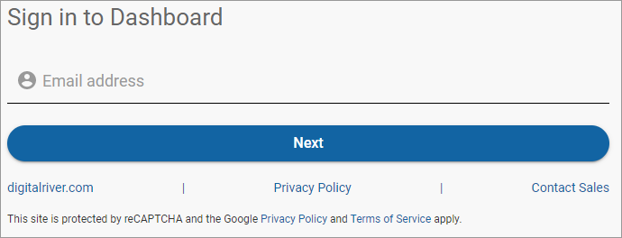

# Reset your password

If you forget your password, you can reset it by having instructions sent to your registered phone number (if multi-factor authentication is enabled) or the email address that you entered during activation.&#x20;


**Note:** To have instructions sent to your registered phone number, you must have [multi-factor authentication enabled](profile-settings/enabling-two-factor-authentication.md).


To reset your password:

1. Go to the [Sign in](https://dashboard.digitalriver.com/login) page, enter your email address, and click **Next**.\
   
2. Click the **Forgot?** link.\
   
3. Enter your email address and click **Submit**.\
   
4. Choose to receive either **Email** or **Text message** and click **Submit**. \
   
   * If you select the **Email** option, click **Return to sign in**.\
     \
     When you receive the email, click **Reset your password**.\
     
   * If you select the **Text message** option and have [multi-factor authentication enabled](profile-settings/enabling-two-factor-authentication.md), Digital River will send a code to your registered mobile phone. Enter your code in the **Verification code** field and click **Submit**.\
     \
     **Note:** The Digital River Dashboard application provides multifactor authentication (MFA) to ensure maximum security. Choose your phone number or Google Authenticator [to set up MFA](profile-settings/enabling-two-factor-authentication.md).\
     If you are using both Digital River Dashboard and eCompass, you are required to set up MFA for both applications. Use the same username and password for both applications, so you only need to set up MFA once. Your credentials are applied to both applications in the same way.\
     \
     
5. Enter and confirm your new password and then click **Confirm**.\
   \
   If the password reset is successful, the **Sign in** page appears.
6. Complete the fields using your email address and new password and click **Sign in**.\
    (5) (5) (2) (1) (1) (6) (7).png>)
