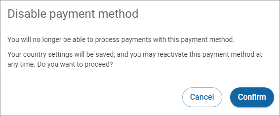

# Enabling or disabling a payment method

To enable or disable a payment method:

1. Click **Payment methods** in the left navigation. The Payment methods page appears.
2. Click the down arrow  to the left of the payment method you would like to view the details of. The expanded payment method details appear.
3. Click the toggle next to the payment method you want to enable or disable. If you disable a payment method, the Disable payment method dialog box appears.\
   
4. Click **Confirm**. Note that you will no longer be able to process payments with this payment method once it is disabled.
5. Click **Save**.
