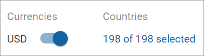
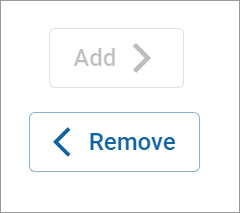

# Managing countries

To manage countries for a payment method:

1. Click **Payment methods** in the left navigation. The Payment methods page appears.
2. Click the down arrow  to the left of the payment method you would like to view the details of. The expanded payment method details appear.
3. Click the blue link under **Countries**.\
   \
   The Manage countries transfer list appears.
4. Select the countries you want to add to or remove from the **Enabled countries** column.
5. Click the **Add** and **Remove** buttons to add or remove countries.\
   
6. Click **Update.**
