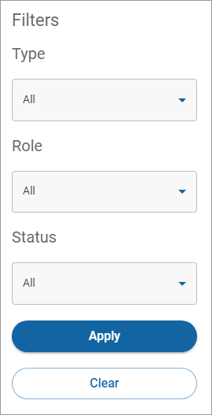

# Filtering your users and roles

## Setting your filter parameters

The following table lists the parameters you can define when you filter your users and roles.

| Parameter | Definition                                                                                                                                                    |
| --------- | ------------------------------------------------------------------------------------------------------------------------------------------------------------- |
| Type      | Type of user you want to view, if available. Examples are `Client` or `Partner`.                                                                              |
| Role      | The role you want to view. You can choose from `Administrator`, `Developer`, `Customer service`, `User manager`, or `Finance Manager.`                        |
| Status    | The status of the user. You can choose from `Staged`, `Provisioned`, `Active`, `Recovery`, `Locked out`, `Password expired`, `Suspended`, or `Deprovisioned.` |

## Filtering your users and roles

To filter the users and roles in the Users and roles list:

1. Click **Filter**. The Filters dialog appears.\
   
2. Complete all or some of the fields and click **Apply**.

The Filter button displays how many changes you applied to the Filter settings while you are on the page. The Filter settings return to their default settings when you leave the page. To clear the settings on the filter, click **Filter** and then click **Clear**.
