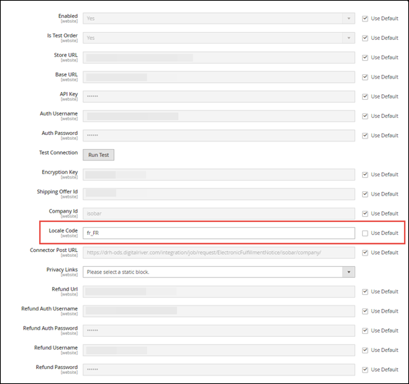

# Appendix

* [Exhibit A: Direct Debit supported countries](appendix.md#exhibit-a-direct-debit-supported-countries)
* [Exhibit B: Apple Pay supported currencies](appendix.md#exhibit-b-apple-pay-supported-currencies)
* [Exhibit C: Apple Pay supported countries](appendix.md#exhibit-c-apple-pay-supported-countries)
* [Exhibit D: Wire Transfer supported currencies](appendix.md#exhibit-d-wire-transfer-supported-currencies)
* [Exhibit E: Wire Transfer supported countries](appendix.md#exhibit-e-wire-transfer-supported-countries)
* [Exhibit F: Klarna supported countries and currencies](appendix.md#exhibit-f-klarna-supported-countries-and-currencies)
* [Exhibit G: Eligible tax group, type, and code](appendix.md#exhibit-g-eligible-tax-group-type-and-code)
* [Exhibit H: Web site, store, store view base configuration ](appendix.md#exhibit-h-web-site-store-store-view-base-configuration)
* [Exhibit I:  Connector acquisition sequence diagram](appendix.md#exhibit-i-connector-acquisition-sequence-diagram)

## Exhibit A: Direct Debit supported countries

See [Direct Debit](https://docs.digitalriver.com/digital-river-api/payments/payment-integrations-1/digitalriver.js/payment-methods/direct-debit#configuring-sepa-direct-debit-for-digitalriver.js) for the latest information on supported countries.

|               |                             |
| ------------- | --------------------------- |
| Austria       | Lithuania                   |
| Belgium       | Luxembourg                  |
| Bulgaria      | Malta                       |
| Croatia       | Monaco                      |
| Cyprus        | Netherlands                 |
| Czechia       | Norway                      |
| Denmark       | Poland                      |
| Estonia       | Portugal                    |
| Finland       | Romania                     |
| France        | San Marino                  |
| Germany       | Slovakia                    |
| Greece        | Slovenia                    |
| Hungary       | Spain                       |
| Iceland       | Sweden                      |
| Ireland       | Switzerland                 |
| Italy         | United Kingdom              |
| Latvia        | Vatican City State/Holy See |
| Liechtenstein | Principality of Andorra     |

## Exhibit B: Apple Pay supported currencies

See [Apple Pay](https://app.gitbook.com/@digital-river/s/digitalriver-js/payment-methods/apple-pay) for the latest information on supported currencies.

|     |     |
| --- | --- |
| AED | KRW |
| ARS | KWD |
| AUD | LBP |
| BHD | MXN |
| BRL | MYR |
| CAD | NOK |
| CHF | NZD |
| CLP | OMR |
| CNY | PHP |
| COP | PLN |
| CZK | QAR |
| DKK | RUB |
| EGP | SAR |
| ETB | SEK |
| EUR | SGD |
| GBP | THB |
| HKD | TRY |
| IDR | TWD |
| ILS | UAH |
| INR | USD |
| JOD | ZAR |
| JPY |     |

## Exhibit C: Apple Pay supported countries

See [Apple Pay](https://app.gitbook.com/@digital-river/s/digitalriver-js/payment-methods/apple-pay) for the latest information on supported countries.

|                |                      |
| -------------- | -------------------- |
| Austria        | Italy                |
| Australia      | Jersey               |
| Belgium        | Japan                |
| Bulgaria       | Kazakhstan           |
| Brazil         | Liechtenstein        |
| Canada         | Lithuania            |
| Switzerland    | Luxembourg           |
| China          | Latvia               |
| Cyprus         | Monaco               |
| Czech Republic | Macao                |
| Germany        | Malta                |
| Denmark        | Netherlands          |
| Estonia        | Norway               |
| Spain          | New Zealand          |
| Finland        | Poland               |
| Faroe Islands  | Portugal             |
| France         | Romania              |
| United Kingdom | Russia               |
| Guernsey       | Saudi Arabia         |
| Greenland      | Sweden               |
| Greece         | Singapore            |
| Hong Kong      | Slovenia             |
| Croatia        | Slovakia             |
| Hungary        | San Marino           |
| Ireland        | Taiwan               |
| Isle of Man    | Ukraine              |
| Iceland        | United States        |
|                | United Arab Emirates |

## Exhibit D: Wire Transfer supported currencies

See [Wire Transfer](https://docs.digitalriver.com/digital-river-api/payments/payment-integrations-1/digitalriver.js/payment-methods/wire-transfer) for the latest information on supported currencies.

|     |     |
| --- | --- |
| AUD | MYR |
| BHD | NOK |
| CAD | NZD |
| CHF | PLN |
| CZK | QAR |
| DKK | RUB |
| EUR | SEK |
| GBP | SGD |
| HKD | THB |
| HUF | USD |
| JPY | ZAR |
| KWD |     |

## Exhibit E: Wire Transfer supported countries

See [Wire Transfer](https://docs.digitalriver.com/digital-river-api/payments/payment-integrations-1/digitalriver.js/payment-methods/wire-transfer) for the latest information on supported countries.

|                |                      |
| -------------- | -------------------- |
| Austria        | Luxembourg           |
| Australia      | Malta                |
| Bahraini       | Netherlands          |
| Belgium        | New Zealand          |
| Canada         | Norway               |
| Cyprus         | Poland               |
| Czech Republic | Portugal             |
| East Malaysia  | Qatar                |
| Estonia        | Romania              |
| Finland        | Russia               |
| France         | Spain                |
| Germany        | Singapore            |
| Greece         | Slovenia             |
| Hong Kong      | Slovakia             |
| Hungary        | South Africa         |
| Ireland        | Sweden               |
| Italy          | Switzerland          |
| Japan          | Thailand             |
| Kuwait         | United States        |
| Latvia         | United Arab Emirates |

## Exhibit F: Klarna supported countries and currencies

See [Klarna](https://docs.digitalriver.com/digital-river-api/payments/payment-integrations-1/digitalriver.js/payment-methods/klarna) for the latest information on supported currencies.

| Countries      | Currencies |
| -------------- | ---------- |
| Austria        | DKK        |
| Denmark        | EUR        |
| Finland        | GBP        |
| Germany        | NOK        |
| Netherlands    | SEK        |
| Norway         | USD        |
| Sweden         |            |
| United Kingdom |            |
| United States  |            |

## Exhibit G: Eligible tax group, type, and code

[Click this link](https://docs.digitalriver.com/digital-river-api/product-management/creating-and-updating-skus#tax-code) to learn how to set the tax code and what codes are available in the Digital River API.

## Exhibit H: Web site, store, store view base configuration

## Exhibit I: Connector acquisition sequence diagram


Download to view the Connector acquisition sequence diagram

