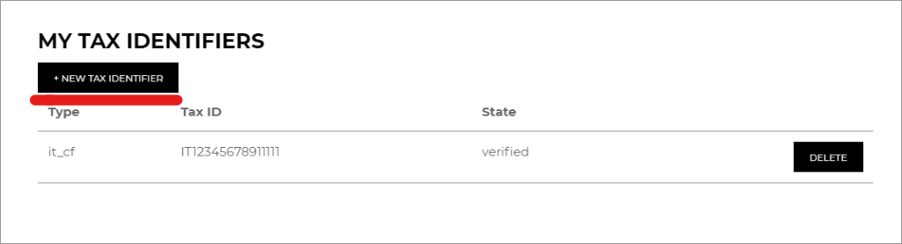

# Global tax identifiers

The Digital River Salesforce B2B Commerce App supports Tax Identifiers. Tax Identifiers are used for tax assessment and invoicing purposes. In most value-added tax (VAT) schemes, domestic sales to business customers are assessed tax and customers then take a credit for this tax paid when they complete their monthly or quarterly VAT return. In these cases, customers need the invoice to display their tax identifier so they can obtain this credit.

Alternatively, _cross-border sales_ to business customers are not assessed tax in most VAT schemes. Instead, in a practice called reverse charge, customers self-assess the tax while simultaneously taking a credit for the tax when they complete their monthly or quarterly VAT return. In these cases, the tax identifier is used to determine whether or not a reverse charge applies to a specific order.

Additionally, in a limited number of cases, tax identifiers are collected because they are [required by a specific country’s tax authority](https://docs.digitalriver.com/digital-river-api/checkouts-and-orders/tax-identifiers#supported-tax-identifiers) for invoicing purposes.

Authenticated Non-US customers will be able to add one or more tax Identifiers to their profile from the **Order Review** page in the checkout flow and also from the **My Account** page.

## Add tax identifiers from the My Account page

1. Log in to the Storefront.
2. Go to **My Account**.
3. Click the **My Tax Identifiers** link.\
   &#x20;
4. Click **New Tax Identifiers** to add new tax identifiers.\
   &#x20;
5. Select a country from the dropdown list.\
   &#x20;
6. If the selected country is eligible for adding tax identifiers, boxes appear for entering the VAT Id(s).
7. Enter a valid Tax identifier. If the Tax Id passes the format validation, a green box displays with a tick mark as shown. Click **Save** to add the tax identifier to your profile.\
   &#x20;.png>)\
   &#x20;&#x20;

## Delete tax identifiers from the My Account page

The app also supports the deletion of Tax Identifiers that were previously added to the user profile from the My Account page.

1. Log in to the Storefront.
2. Go to **My Account**.
3. Click the **My Tax Identifiers** link.
4. All the Tax Identifiers that were previously added to your profile display. To delete an identifier, click **Delete** at the end of its row in the list, which opens a message asking for confirmation.\
   \
    \

5. Click **Confirm** to delete the tax identifier from your user profile.


**Note:** If there is any issue while adding or deleting the tax identifier, a generic error message appears and the error information is logged to the custom DCM Application Log object.


## Tax identifiers on the Order Review page

The authenticated shopper must enter their tax identifier each time an order is placed. Unlike the US Tax Certificates, the tax identifiers which are saved to the user’s profile will not be applied automatically to the order. Within the checkout flow, the authenticated user will be able to apply a saved tax identifier and/or apply a tax identifier directly to the order without saving it.

You will be able to add or delete a tax identifier from your user profile from the Order Review page as well.

1. Log in to the Storefront.
2. Add products to the cart and click **Checkout** to open the User Information page.
3. Click **Continue** to open the Shipping page.
4. On the Shipping page, click **Accept Terms and Proceed** to open the Order Review page.
5. The purchase type will be set to Business by default and the shopper can change it to Individual by clicking **Change to Individual**. This information is stamped on the DR Customer Type field on the CC Cart object.
6. On the Order Review page, under the Apply Saved Tax Identifiers section, find and click the **Manage Tax Identifiers** link, which opens a window where you can add or delete tax identifiers.\
   \
   .png>) \

7. Tax identifiers can be added or deleted by following the steps under Add/Delete Tax Identifiers on the My Account page.


**Note:** The tax identifier section will be displayed on the Order Review page only for a non-US shopper, that is:

1. The cart contains only a physical product or a combination of physical and digital products and the Ship To address is non-US.
2. The cart contains only a digital product and the Bill-To address in SF is non-US.


An authenticated shopper can apply a saved tax identifier and/or apply a tax identifier directly to the order without saving it.

1. Log in to the Storefront.
2. Add the products to the cart and click **Checkout** to open the User Information page.
3. Click Continue to open the Shipping page.
4. On the Shipping page, click **Accept Terms and Proceed** to open the Order Review page.
5. The purchase type will be set to Business by default and the shopper can change it to Individual by clicking **Change to Individual**. This information is stamped on the DR Customer Type field on the CC Cart object.
6. On the Order Review page, the shopper can select previously saved tax identifier(s) from the **Apply Saved Tax Identifier** section and/or apply a tax identifier directly to the order without saving it by adding the **Tax Identifier from Other Tax Identifier** section. \
    \

7. After selecting the existing tax identifier and/or adding a tax identifier directly to this order, click **Apply Tax Identifiers**.\
   &#x20;&#x20;
8. The Amounts section is now refreshed on the Order Review page. \
   &#x20;
9. The user can now proceed to the payment page and place an order. Once the order is placed, the tax identifiers will be stamped on the **Digital River Tax Identifiers** field of the CC Order object.


**Note:** If there is an issue while applying tax identifiers on the Order Review page, a generic error message appears on the Order Review page and the detailed error information is logged to the DCM Application Log object. The shopper will still be able to proceed to the payment page and make a purchase.


## Sequence diagram

The following sequence diagram explains the tax identifier flow.



