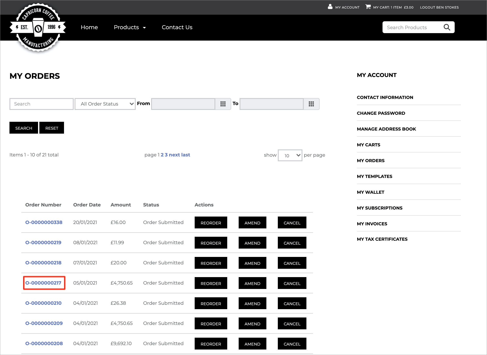
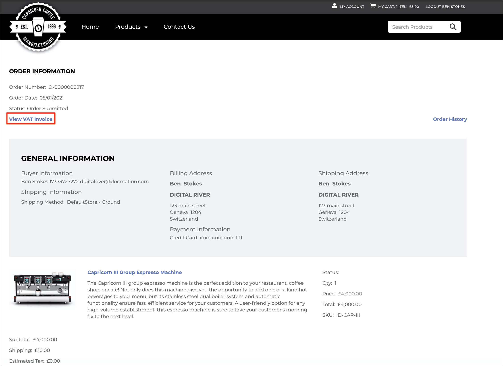

# VAT invoices

## VAT invoice prerequisite

Order is placed on a site/location that will generate a VAT Invoice (DR Ireland Entity).

## VAT invoice flow

Whenever a VAT invoice created event is generated for an order, the app consumes this webhook event and stamps the Invoice File Id on the custom field “DR VAT Invoice File Id” available on the CC Order object. To download the VAT Invoice for an Order, the Customer must follow the steps below:

1. Log in to the Storefront.
2. The customer can view all his/her Orders by going to My Account and then My Orders.\
   &#x20;&#x20;
3. Click the `Order Number` link to open the order for which you need to download the VAT Invoice. Click the `View VAT Invoice` link to download the VAT Invoice file.\
    \


**Note:** The VAT Invoice link is available only on orders for which the VAT Invoice File Id is generated and stamped on the CC Order.


