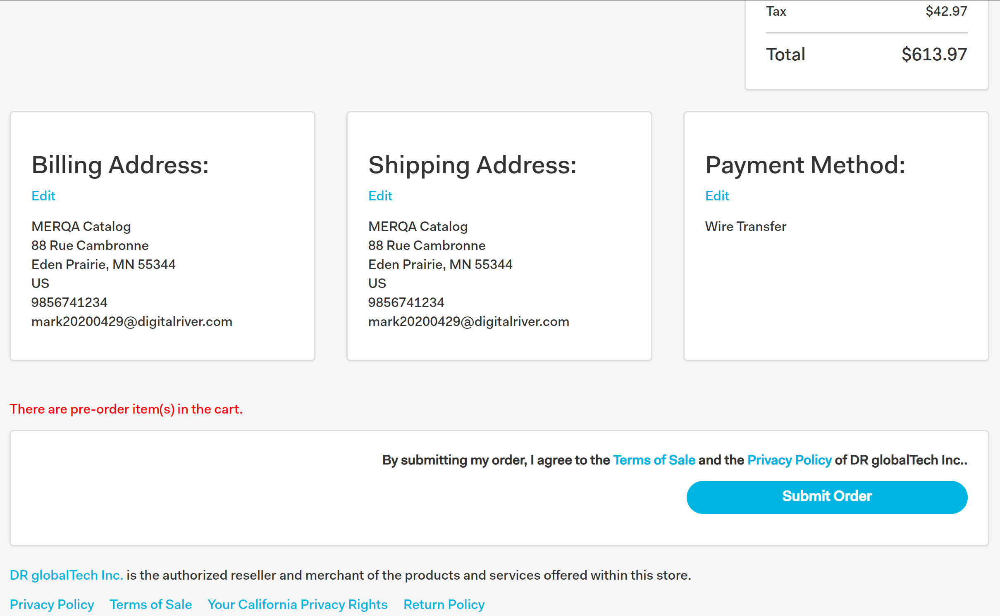

# Capturing the Terms of Sale (TOS) acceptance

You capture when a customer accepts the TOS. The following requests allow a customer to accept the TOS from the cart:

* Submit Cart: `POST /v1/shoppers/me/carts/active/submit-cart`
* Update or Create Cart: `POST /v1/shoppers/me/carts/active`

## Creating the TOS

You can use a [DigitalRiver object](../../general-resources/reference/digitalriver-object.md) provided by [DigitalRiver.js](../../payments/payments-solutions/digitalriver.js/) to create the TOS required by Digital River.

## Setting the TOS acceptance parameter

If you want the customer to accept the TOS, you need to add the `termsOfSalesAcceptance` parameter when you create the Cart.&#x20;

| Parameter              | Description                                                                |
| ---------------------- | -------------------------------------------------------------------------- |
| termsOfSalesAcceptance | The Terms of Sale Acceptance. The enumerated values are `true` or `false`. |

## Example create request and response

Create a Cart object with a `POST` request:




```json
{
  "cart": {
    "ipAddress": "10.24.2.28"
    "termsOfSalesAcceptance": "true"
  }
}
```




A `201 Created` response returns a Cart object:




```json
{
    "uri": "https://api.digitalriver.com/v1/shoppers/me/carts/active",
    "paymentMethods": {},
    "applyPaymentMethod": {},
    "submitCart": {},
    "webCheckout": {},
    "id": "47278010023",
    "lineItems": {},
    "totalItemsInCart": "1",
    "businessEntityCode": "DR_INC-ENTITY",
    "termsOfSalesAcceptance":"true"
    "billingAddress": {},
    "shippingAddress": {},
    "payment": {},
    "shippingOptions": {},
    "pricing": {}
}
```




## How a customer accepts the TOS

How a user accepts the TOS depends on which option you selected when you configured Terms of Sale Acceptance on the [Checkout tab](https://help.digitalriver.com/help/gc/Administration/Site/Configuring-site-settings.htm#CheckoutTab) under Configure Site Settings in Global Commerce.

### Customer passively accepts terms through order submission

If you chose **Shopper passively accepts terms through order submission**, the customer accepts the TOS when they submit the order. Digital River requires this setting when we are the Reseller of Record.



### The customer actively accepts the TOS

If you chose **Shopper actively accepts terms before completing the purchase**, the customer must click the checkbox to accept the TOS. Sites based in the EU require this setting.

.png>)

### No acceptance required

Choose **No Acceptance Required** if your site does not require the customer to accept the TOS.
