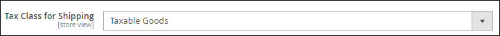
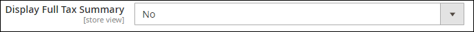
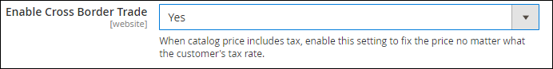
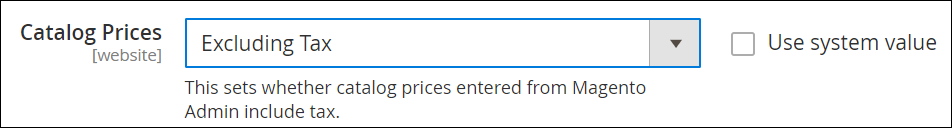
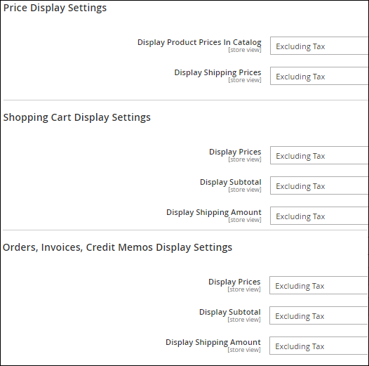
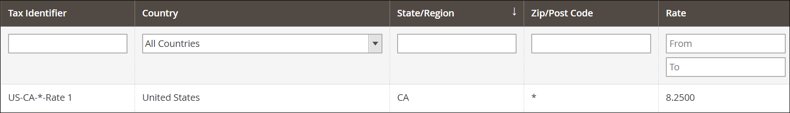
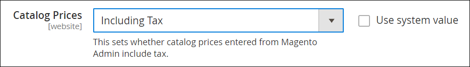
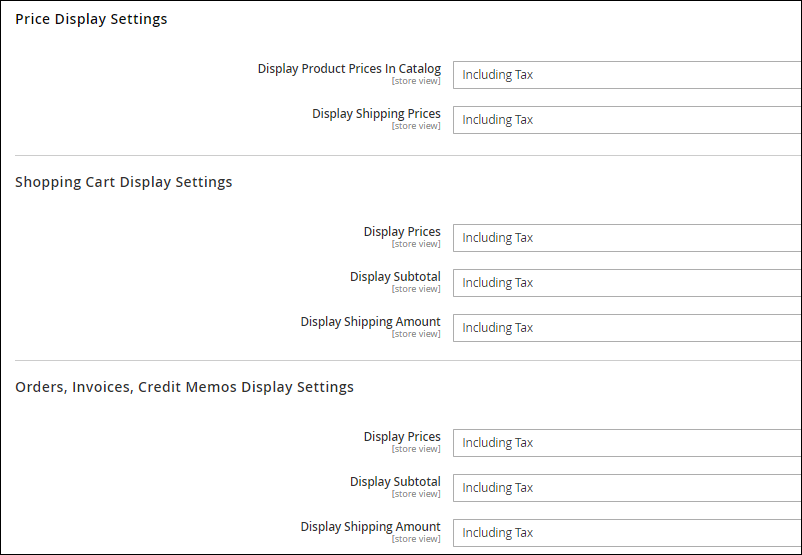

# Configure tax settings

The Magento Digital River extension is responsible for providing the end tax calculation for the shopper navigating the checkout. The extension supports both tax-inclusive and tax-exclusive pricing models and handles all remittance and tax liabilities to local governments globally. However, the transactional tax is not calculated until after the shopper confirms their billing and shipping address. To ensure estimated tax and tax display is consistent throughout the pre-checkout pages, Digital River recommends the following configurations for tax, based on pricing models.


**Note:** Each Magento website/store should be tax-exclusive or tax-inclusive.


## Tax settings

To ensure the correct display of taxes in all situations, please configure your Magento tax settings per the following: Navigate to **Stores**, then to **Configuration**, then to **Sales**, and then to **Tax**.&#x20;


**Note:** The Digital River extension cannot be used with other Magento tax partners.


1. In the **Tax Classes** section, update **Tax Class for Shipping** to **Taxable Goods**.\
   &#x20;&#x20;
2. In the **Shopping Cart Display Settings**, keep the **Display Full Tax Summary** set to **No**.\
   &#x20;&#x20;
3. In the **Calculation Settings** section of the **Tax configuration**, set **Enable Cross Border Trade** to **Yes**. This will ensure proper tax treatment on any cross-border shipments on your site.\
   &#x20;&#x20;

## Tax-exclusive settings

To display tax-exclusive values in the order summary prior to the checkout/#payment page, configure the following tax settings:

1. Navigate to **Stores**, then to **Configuration**, then to **Sales**, then to **Tax**, and then to **Calculation Settings**.
2. Verify **Catalog Prices** is set to `Excluding Tax` —this is the default setting.\
   &#x20;&#x20;
3. Open the **Price Display Settings**, **Shopping Cart Display Settings**, and **Orders, Invoices, Credit Memos Display Settings** within the same settings and verify the following are also configured for `Excluding Tax` —these are the default settings.\
   &#x20;&#x20;
4. Navigate to **Stores**, then to **Tax Zones and Rates**. All supported countries (and US states) must be added to the table with an estimated tax rate. Current tax rates for each country and state sales tax can be provided by Digital River during the client implementation phase. \
   (see [https://docs.magento.com/user-guide/tax/tax-zones-rates.htm](https://docs.magento.com/user-guide/tax/tax-zones-rates.html?itm\_source=merchdocs\&itm\_medium=search\_page\&itm\_campaign=federated\_search\&itm\_term=tax%20zone%20rates).)\
   &#x20; \
   **Note:** Each store should be configured for all available ship-to countries available for that store. A purchase made from a store with tax-inclusive pricing (a German store, for example) with a shipping address from a tax-exclusive region (the United States, for example) can result in incorrect tax calculation.
5. Navigate to **Stores**, then to **Tax Rules**. Add a single tax rule for all tax rates created in step 4.

## Tax-inclusive settings

To display prices inclusive of tax in the order summary prior to the checkout/#payment page, configure the following tax settings in Magento:

1. Navigate to: **Stores**, then to **Configuration**, then to **Sales**, then to **Tax**, and then to **Calculation Settings**.
2. Update **Catalog Prices** to `Including Tax`.\
   &#x20;&#x20;
3. Open the **Price Display Settings**, **Shopping Cart Display Settings**, and **Orders, Invoices, Credit Memos Display Settings** within the same settings and update the following settings to `Including Tax`.\
   &#x20;&#x20;
4. Navigate to **Stores**, then to **Tax Zones and Rates**. All supported countries using inclusive tax settings must be added to the table with the appropriate tax rate. Current tax rates for each country can be provided by Digital River during the implementation phase.\
   &#x20; \
   **Note:** Each Magento store view or Website should be configured for all available ship-to countries available in that store.
