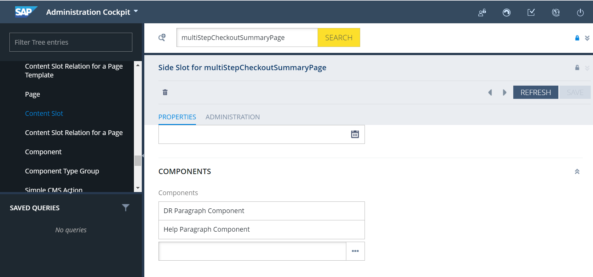
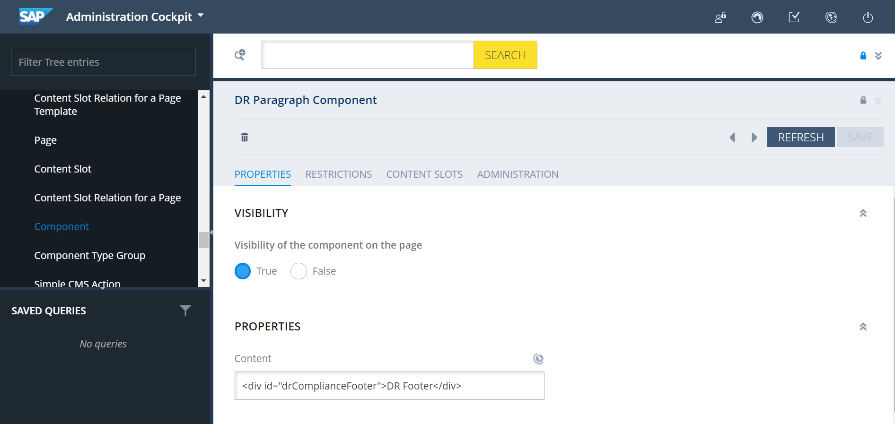

# Step 9: Add the Digital River compliance statement

The merchant system must show a Digital River compliance statement in the footer section of every checkout step. The Content Management System (CMS) component is available for integrating the compliance footer in the storefront.&#x20;

1. Download and run the following `DR_footer.txt` file, converted from `*.ImpEx` format.&#x20;
2. Change the content catalog name and version in the file and copy the file contents to the SAP Commerce HAC window.
3. Load and execute the file. If you see any errors when updating the existing content slot, update the file contents from the **Backoffice** Web Content Management System (WCMS).&#x20;

```
$contentCatalog=electronicsContentCatalog
$contentCatalogName=Electronics Content Catalog
"$contentCV=catalogVersion(CatalogVersion.catalog
(Catalog.id[default=$contentCatalog]),CatalogVersion.version[default=Online])
[default=$contentCatalog:Online]"
$lang=en

INSERT_UPDATE CMSParagraphComponent;$contentCV[unique=true];uid[unique=true];
name;&componentRef
;;DRComplianceFooter;DR Paragraph Component;DRComplianceFooter

UPDATE CMSParagraphComponent;$contentCV[unique=true];uid[unique=true];content
[lang=$lang]
";;DRComplianceFooter;""<div id=""""drComplianceFooter"""">DR Footer</div>"""

INSERT_UPDATE ContentSlot;$contentCV[unique=true];uid[unique=true];name;active;
cmsComponents(&componentRef)
";;SideContent-multiStepCheckoutSummaryPage;Side Slot for 
multiStepCheckoutSummaryPage;true;DRComplianceFooter,HelpParagraphComponent"
```

The `showDRComplianceFooter` method in `digitalriveraddon.js` will handle the loading for the compliance footer in the CMS component.




