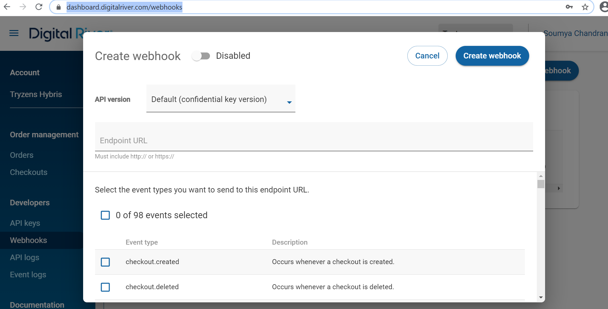

# Step 11: Customize the locale, OMS, and webhooks

## Localization

The Digital River extension has a customized storefront message available in English. Properties for all custom messages are added to the `base_en.properties` and `base_de.properties` files in the `digitalriveraddon` and `digitalriverb2baddon` modules. For the rest of the supported languages in the merchant application, copy the properties from `base_en` to the respective language property.


This extension does not have any restrictions based on country or currency. However, during checkout, the Tax Exemption page is displayed based on the selected country.


## Order Management System (OMS)&#x20;

The Digital River Order Management System (OMS) extension is built on an out-of-the-box (OOB) `yacceleratorordermanagement` template. The OOB order flow and actions have been changed to support various OMS functionalities of Digital River, including fulfillments, cancellations, and returns.

### Order flow

* A modified order flow is available in the `projectdata-dynamic-business-process-order.impex` file in the `yacceleratorordermanagement` folder in the provided archive.
* If the Digital River order status is `in_review` or `pending_payment`, the system pauses the order flow. The system will resume the order flow after the application receives an `order.accepted` or `order.blocked` event from Digital River.
* Once the order is shipped, the system sends a create fulfillment request to Digital River, and the order flow will wait for an `order.charge.capture.complete` and `order.charge.completed` event from Digital River before moving to the `complete` state.
* The payment transaction table for an order will have all the entries for Digital River payment transactions, including tokenization, authorization, capture, and returns.
* The system sends a Digital Products Fulfilment request to Digital River immediately after an order confirmation email is triggered. A new action has been integrated after the `sendOrderPlacedNotificationAction` completes. The merchant must integrate the same action or fulfillment API call when fulfilling digital products in the custom application.

### Cancel flow

Digital River sends a cancel request whenever an end-user raises a cancel request through the self-service cancel. A Cancel API call is integrated into the immediate cancel flow as well. The merchant application can reuse this API call or integrate the service method on any other custom cancel flows.

### Return flow

This extension supports two different ways to create refund requests at Digital River:

#### Self-service return

To send a refund request to Digital River, change the return order flow available in the `projectdata-dynamic-business-process-return.impex` file in the `yacceleratorordermanagement` folder in the provided archive.

When Digital River creates a request, the system will pause the refund flow until it receives an `order.charge.refund.complete` and `refund.complete` from Digital River.

Transaction tables will be updated with refund entries once the `order.charge.refund.complete` is received. The return will complete the action after the `refund.complete` event is received.

#### Customer support return

A customer support agent can go to Digital River [Dashboard](https://dashboard.digitalriver.com/login) to create a refund request for an order. To access the Dashboard, click the **DigitalRiver Refund** button in the Backoffice Order view. The `DRRefund` **** button will redirect the customer support agent to the respective Order details page in the Dashboard. Support agents will be prompted for their user credentials when they access Dashboard. Appropriate return and refund entries will be made in the Dashboard app once it receives the  `refund.complete` event for that order.

## Event handling

The Digital River SAP Commerce Cloud extension provides the service class for capturing and handling various order update events from the Digital River system. The extension handles the following events:

* `order.accepted`
* `order.blocked`
* `order.charge.cancelled`
* `order.charge.capture.complete`
* `order.charge.completed`
* `order.charge.refund.complete`
* `refund.complete`
* `refund.pending_information`

Merchants can create a [webhook ](https://docs.digitalriver.com/digital-river-api/administration/dashboard/developers/webhooks/creating-a-webhook)by providing the endpoint URL in the [Dashboard](https://dashboard.digitalriver.com). Check the status of the events mentioned above from the [event log](https://docs.digitalriver.com/digital-river-api/administration/dashboard/developers/event-logs).

Use the following format when creating entering the endpoint URL:

`https://<domain>/digitalriverwebservices/dr/events`

