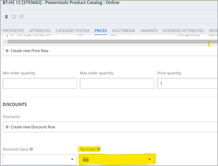
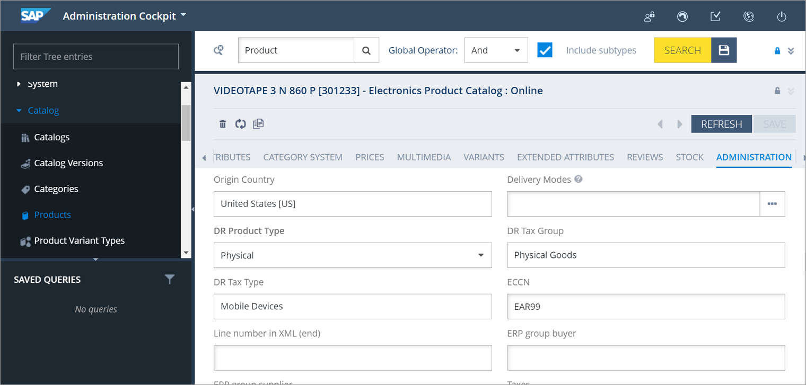

# Step 4: Configure the product

Update the product’s required custom attributes listed in the following table before proceeding to checkout.

| Attributes        | Description                                                                               |
| ----------------- | ----------------------------------------------------------------------------------------- |
| `countryOfOrigin` | The product’s country of origin                                                           |
| `eccn`            | The product’s Export Control Classification Number                                        |
| `drTaxGroup`      | The product’s tax group                                                                   |
| `drTaxType`       | The product’s tax group type                                                              |
| `drProductType`   | The type of product, either physical or digital                                           |
| `hsCode`          | The Harmonized System Code, an attribute indicating if the product is applicable for Duty |
| `drSkuGroup`      | Select the appropriate product tax from the list of groups returned from Digital River    |


If you are using Digital River tax configuration, disable the OOB tax configuration. To disable the OOB tax configuration, Go to **Backoffice**, click the **Prices** tab, and select **n/a** from the **Tax Class** dropdown list.




You can update product attributes either through **Backoffice** or by using the following `ImpEx` example for a bulk update.

```
$productCatalog=electronicsProductCatalog
$productCatalogName=Electronics Product Catalog
$catalogVersion=catalogversion(catalog(id[default=$productCatalog]),version[default='Online'])[unique=true,default=$productCatalog:Online]


INSERT_UPDATE Product;code[unique=true]	
    ;$catalogVersion;countryOfOrigin(isocode);eccn;drTaxGroup(taxGroup);drTaxType(drTaxType);drProductType(code);hsCode;drSkuGroup;
;553637;;US;EAR99;Physical Goods;Mobile Devices;Physical; 6404.20;
;301233;;US;EAR99;Physical Goods;Mobile Devices;Physical; 6404.20;
;592506;;US;EAR99;Software (Downloadable & Physical);Downloadable Media Kits;Digital;;
```


