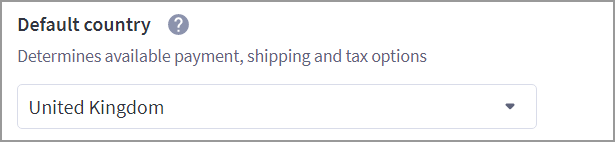
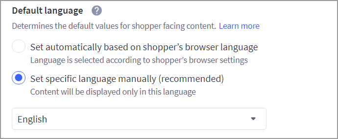

# Step 1: Configure the store profile

It's essential to configure your store profile correctly. Follow these steps to input necessary details such as contact information, default country, and language settings, ensuring all configurations align to avoid discrepancies during checkout and order submission. Here's how to configure your store profile:

Work with your Digital River project manager to configure your store. Digital River will assist in confirming that it meets the [requirements](../introduction/requirements/#features).&#x20;

To configure your store profile:

1. Click **Settings** in the app menu on the left and then click **Store Profile**.
2.  Enter your store contact information.&#x20;

    .PNG>)
3.  Select your **Default country** from the drop-down menu.

    **Note**: You must select the same country for both Default country and [Shipping Origin](step-5-configure-shipping.md). If you do not set this correctly, the totals displayed to the shopper during checkout and order submission will be different.&#x20;

    
4.  Select **Set specific language manually** under Default language, then select the language from the following dropdown menu.

    
5.  Click **Save**.

