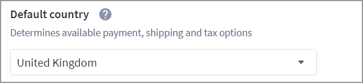
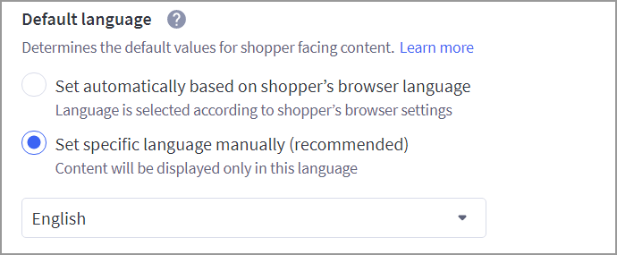

# Step 1: Configure the store profile

Work with your Digital River project manager to configure your store. Digital River will assist in confirming that your store meets [requirements](../introduction/requirements/#features).&#x20;

To configure your store profile:

1. Click **Store Setup** in the app menu on the left and then click **Store Profile**.
2.  Enter your store contact information.&#x20;

    .PNG>)
3.  Select your **Default country** from the dropdown menu.

    **Note**: You must select the same country for both Default country and [Shipping Origin](step-5-configure-shipping.md). If this is not set correctly, the totals displayed to the shopper during checkout and order submission will be different.&#x20;

    
4.  Select **Set specific language manually** under Default language, then select the language from the following dropdown menu.

    
5.  Click **Save**.

