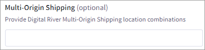

# Step 2: Configure payments


For the [Drop-in](https://docs.digitalriver.com/digital-river-api/payment-integrations-1/drop-in) to work, you have to configure the currency on the BigCommerce storefront and also enable the payment method on the **Digital River Settings** tab. You must complete this task for each supported currency listed in the **Show payment methods** dropdown list.&#x20;


To configure payments:

1. Click **Store Setup** in the app menu on the left and then click **Payments**.
2. From the **Checkout Payment Settings** tab, select the supported currency from the dropdown list under **Show payment methods**. \
   
3. Disable all non-Digital River payment methods, if applicable.
4.  Scroll down to **Online Payment Methods** and expand the pane.

    
5.  Locate **Digital River** and click **Set up**. The Digital River Settings tab appears.

    
6.  From the **Digital River Settings** tab.&#x20;

    
7.  Enter your Digital River API keys obtained from the [Digital River Dashboard](https://dashboard.digitalriver.com/login).

    

    * **Production Confidential Key**–Your Production Confidential Key provided to you by Digital River
    * **Production Public Key**–Your Production Public Key provided to you by Digital River
    * **Test Confidential Key**–Your Test Confidential Key (or “evaluation confidential key”) provided to you by Digital River
    *   **Test Public Key**–Your Test Public Key (or “evaluation public key”) provided to you by Digital River

        **Note**: The same values that you entered for the fields above must also be copied into your Digital River Payments, Fraud, Tax & Compliance Management app.
8.  Select **Yes** from the **Test Mode** dropdown menu. **Test Mode** determines whether your store is in test mode. When you are ready to take payments, change this value to **No** (recommended).

    
9.  Required. Set up your warehouse location. You can use the **Multi-Origin Shipping** setting to support multiple warehouse locations in multiple countries, enter the location combinations in the Multi-Origin Shipping field. When entering the shipping location, use the following format: `line1|line2|city|state|postal code|country code`.\
    You can use a comma (`,`) to delimit multiple shipping location combinations and a double pipe (`||`)such as if there is no value. For example: \
    \
    `US>134-135 main street||Minnesota|MN|55343|US,CA>CA,FR>FR,DEFAULT>CN`

    
10. Click **Save**. Repeat steps 2-10 using the same API keys for each new or updated currency and warehouse location.


Each time you click **Save**, BigCommerce automatically [creates a new webhook endpoint](https://docs.digitalriver.com/digital-river-api/administration/dashboard/developers/webhooks/creating-a-webhook) within your Digital River account  You are responsible for [deleting any duplicate or old webhook endpoints](https://docs.digitalriver.com/digital-river-api/administration/dashboard/developers/webhooks/deleting-a-webhook) within Digital River to avoid sending duplicate event data to BigCommerce.



You must copy the same values that you entered in the fields above into your Digital River **** app.



You must enable and configure the following features within your Digital River account. They are not configurable within BigCommerce.

* [3D-Secure](https://docs.digitalriver.com/digital-river-api/payment-integrations-1/digitalriver.js/reference/digitalriver-object#authenticating-sources)&#x20;
* [CVV required](https://docs.digitalriver.com/digital-river-api/payment-integrations-1/digitalriver.js/reference/digitalriver-object)
* [Payment methods](https://docs.digitalriver.com/digital-river-api/administration/dashboard/settings/payment-methods)
* [Stored credit cards](https://docs.digitalriver.com/digital-river-api/getting-started-1/standards-and-certifications/integration-checklists/checkouts-payment-sources-and-orders#provide-option-to-save-credit-card-for-future-use)

