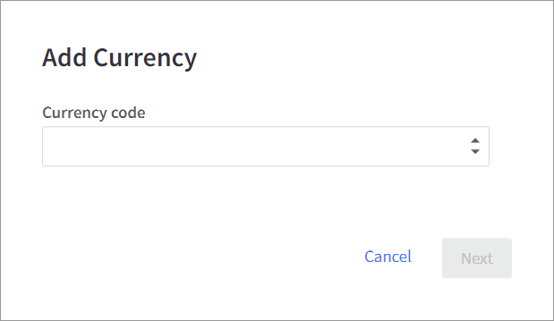
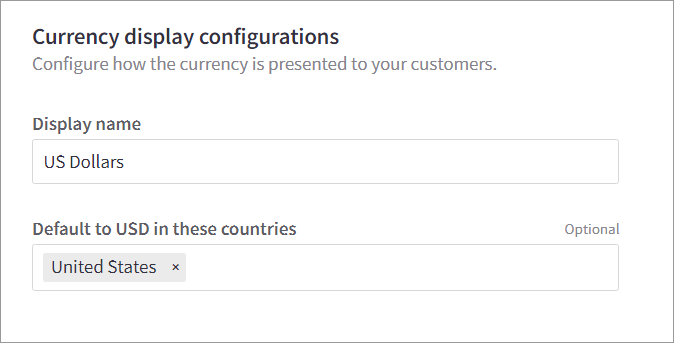
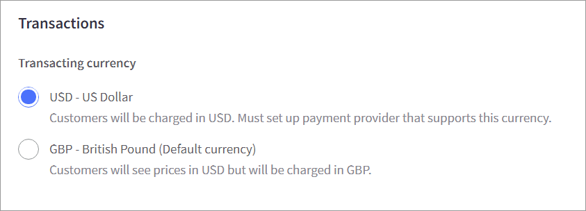
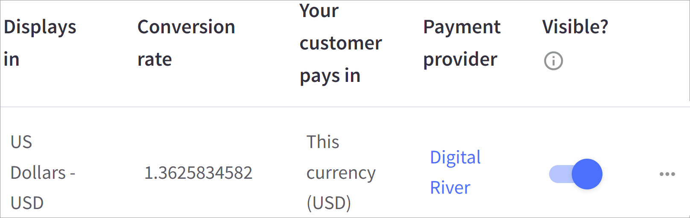

# Step 3: Configure currencies


You must [configure payments](step-2-configure-payments.md) before you configure currencies.


To configure currencies within the BigCommerce:

1. Click **Store Setup** in the app menu on the left and then click **Currencies**.
2.  Click the **Add new currency** button. The Add Currency dialog box appears.

    \

3. Select a currency code from the dropdown menu and click **Next**.
4.  Enter the display name **** for the currency under **Currency display configurations**.

    \

5. Optional. Use Shift+Click to select the countries where this currency will be used. If the field is blank, the currency is available in all countries.
6.  Select an option for **Transacting currency**.

    &#x20;
7. Enter the static conversion rate. The static conversion rate remains the same until you enter a different conversion rate. Using this method avoids constantly fluctuating prices in non-default currencies.
8. Complete the fields under **Currency display** to customize how the currency will appear to customers.
9. Click **Save**.&#x20;
10. To allow shoppers to transact in this currency, click the toggle in the **Visible?** column.&#x20;

## Multi-currency

Digital River on BigCommerce can be configured for multiple currencies at a time. A single Digital River merchant account accepts all Digital River-supported transaction currencies. For more information, visit [Multicurrency](https://support.bigcommerce.com/s/article/Managing-Currencies?language=en\_US#mc).

