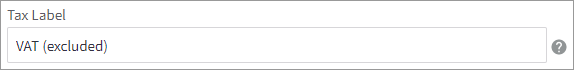

# Step 4: Configure tax

## Configure tax settings

To configure tax settings:

1. Click **Settings** in the menu on the left and then click **Tax**.
2.  Click **Enable** to enable Digital River as a tax service. A green ENABLED text box will appear next to Digital River.&#x20;

    .PNG>)
3. Click **Edit** under **Tax Settings**.
4.  In the **Tax Label** field, type the label you want to use to describe this tax option.

    
5.  Under **Prices Entered With Tax**, and choose **No, I will enter prices exclusive of tax**.&#x20;

    **Note**: You must set **** the **Prices Entered with Tax** dropdown to **No, I will enter prices exclusive of tax.**&#x20;

    
6.  Under **Fallback Tax**, and choose **Use my manual Tax settings**.

    
7. Select the specified option from each of the following dropdown menus:
   * **Calculate Tax Based on**: Destination Address
   * **Shipping Tax Class**: Shipping
   *   **Gift Wrapping Tax Class**: Gift Wrapping\

       ********
8. Under **Configure Tax Display Settings**, select the specified option from each of the following dropdown menus:
   * **Show Prices Within Control Panel**: Excluding Tax
   * **Show Prices on Invoices**: Excluding Tax
   * **Show Tax Charges in Cart and Checkout**: Broken down by tax rate
   *   **Show Tax Charges on Orders and Invoices**: Broken down by tax rate

       
9.  Optional. Under **Configure Default Tax Address**, select a country from the dropdown menu.

    
10. Optional. Select a state from the dropdown menu, if applicable.
11. Optional. Enter a postal code, if applicable.
12. Click **Save**.

## Configure the tax rates and zones

To configure the tax rates and zones:

1. From the Tax page, scroll down to **Set up your own tax rules** and click **Edit** for **Manual Tax**.
2. Click the **Tax Rates & Zones** tab.
3. Click **Add Tax Zone**.
4.  In the **Tax Zone Name** field, type the name you want to use for this tax zone.

    
5. Choose one of the following options for **Tax Zone Type**:
   * **This tax zone is based on one or more countries**
   * **This tax zone is based on one or more states**
   * **This tax zone is based on one or more postal codes**
6.  Select the appropriate country or countries from the **Country** list.

    
7.  Choose the  **All customers in my store option** for **Tax Zone Applies to**.

    ****.png>)****
8.  Select the **Enable this tax zone** check box.

    
9.  Click **Save**.

