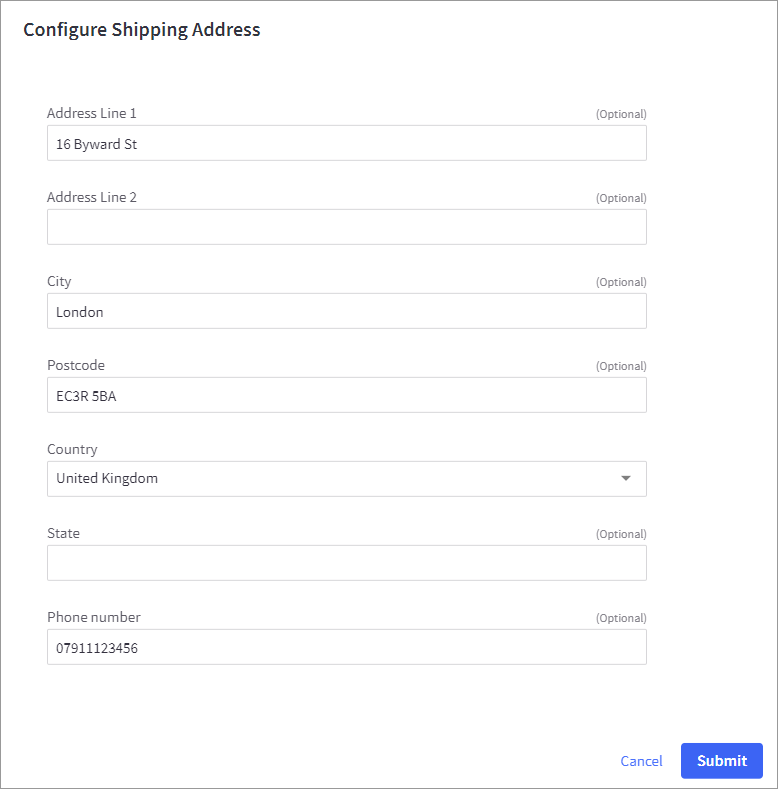
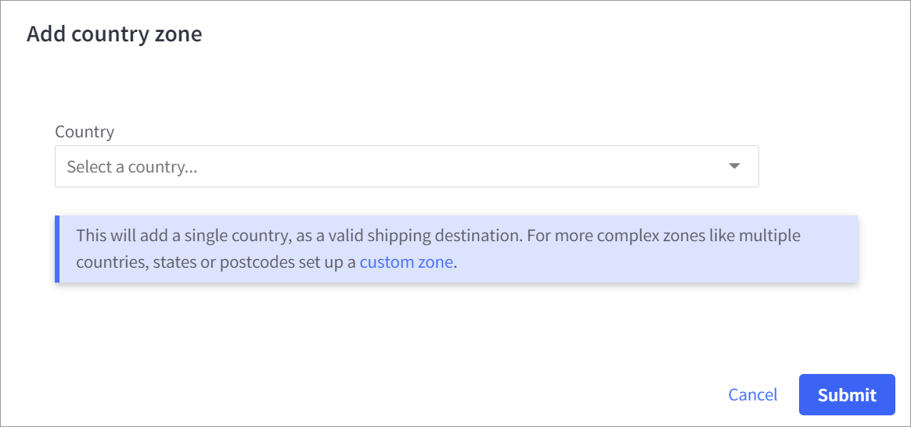
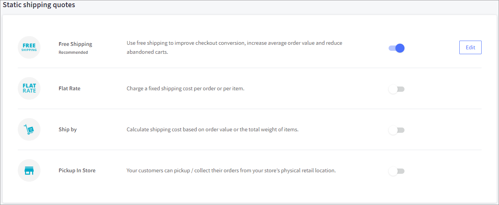
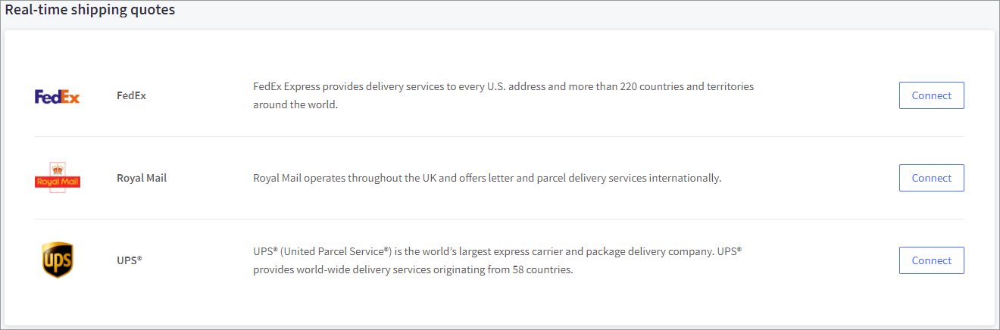
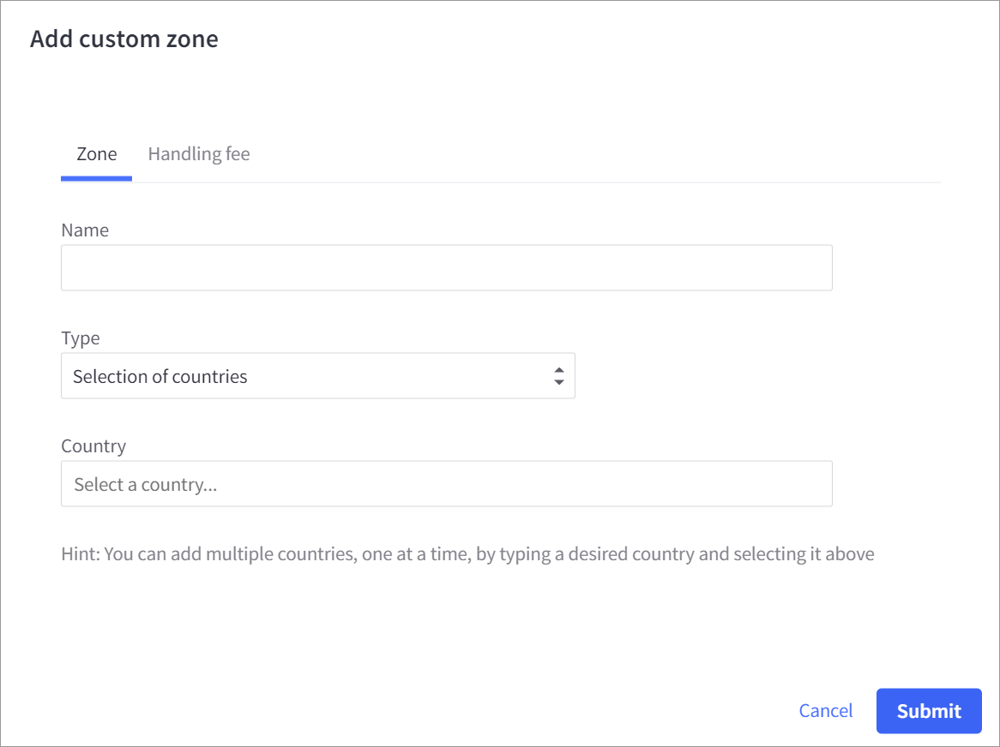
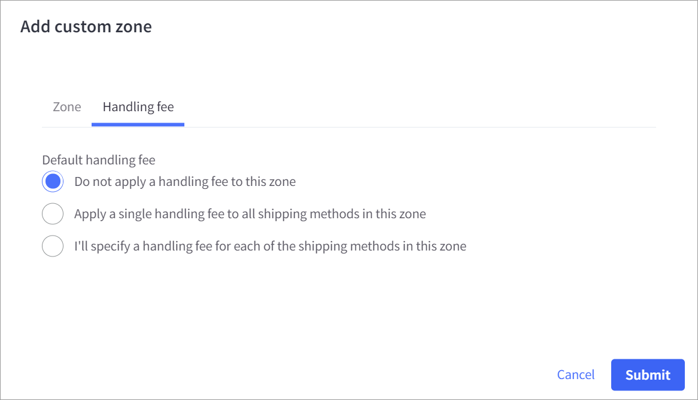

# Step 5: Configure shipping

## Configuring the shipping address

To configure the shipping address:

1. Click **Store Setup** in the app menu on the left and then click **Shipping**. The Shipping Manager page appears.
2.  Under **Shipping Origin**, click **Edit**. The **Configure Shipping Address** dialog appears.

    **Note**: You must select the same country for both [Default country](step-1-configure-the-store-profile.md) and Shipping Origin (ship-from address). If this is not set correctly, the totals displayed to the shopper during checkout and order submission will be different.&#x20;

    \

3. Complete the fields and click **Submit**. Note that the required fields are **Address**, **City Postcode**, and **Country**.

## Adding a country zone

1.  Under **Checkout Shipping Options** on the **Shipping Manager** page, select **Add a country zone** from the **Add shipping zone** dropdown.

    To **Add a country zone**:&#x20;

    1.  Select a country from the **Country** dropdown and click **Submit**. This will add a single country as a valid shipping destination.  For more complex zones like multiple countries, states, or postcodes, set up a [custom zone](step-5-configure-shipping.md#adding-a-custom-zone).

        
    2. To configure shipping quotes for a country, click **Configure** next to the country you added.
    3. Choose one of the following options:
       * To enable static shipping quotes, toggle one of the options to enable under **Static shipping quotes**, complete the fields, and click **Submit**. Repeat this step for each additional option.\
         
       * To configure real-time shipping quotes, click **Connect** next to the real-time shipping option you want to use under **Real-time shipping quotes**, complete the fields under each tab, and click **Submit**. Repeat this step for each additional option.\
         .
    4. Click **Done**.

## Adding a custom zone

To add a custom zone:&#x20;

1. Under **Checkout Shipping Options** on the **Shipping Manager** page, select **Add a custom zone** from the **Add shipping zone** dropdown. The Add custom zone dialog appears.
2.  Complete the fields under the **Zone** and **Handling fee** tabs and click **Submit**.

    

    
3. Click **Configure** next to the zone you added.
4. Choose one of the following options:
   * To enable static shipping quotes, toggle one of the options to enable under **Static shipping quotes**, complete the fields, and click **Submit**. Repeat this step for each additional option.\
     
   * To configure real-time shipping quotes, click **Connect** next to the real-time shipping option you want to use under **Real-time shipping quotes**, complete the fields under each tab, and click **Submit**. Repeat this step for each additional option.\
     .
5. Click **Done**.
