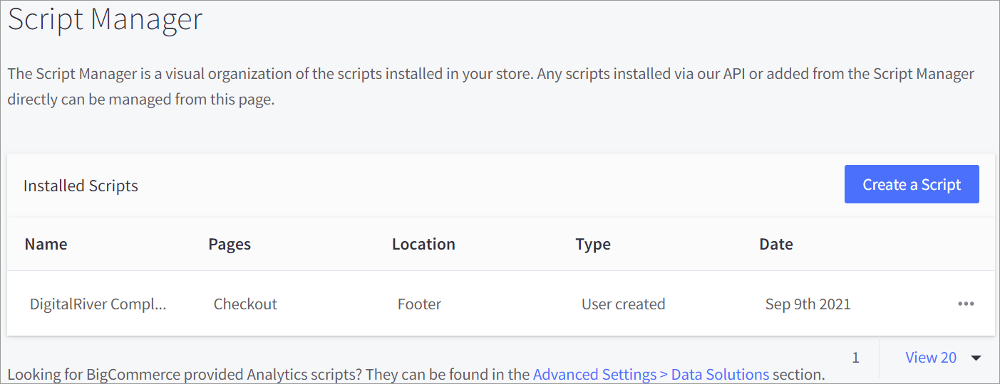
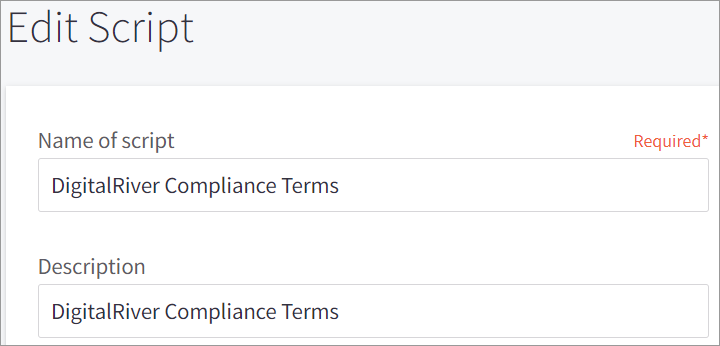
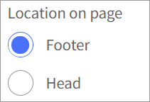
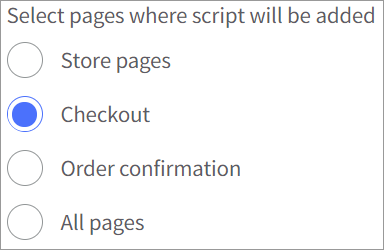
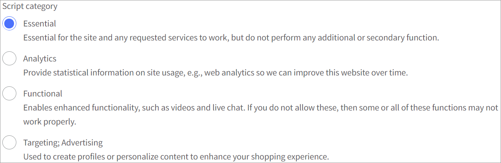
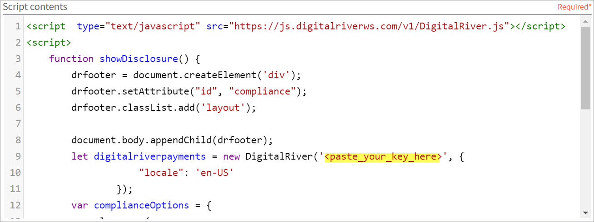

# Step 6: Create a script for Digital River compliance terms

The Script Manager is a visual organization of the scripts installed on your store. Any scripts installed via our API or added from the Script Manager directly can be managed from this page.

To create a script for the Digital River compliance terms:

1. Click **Storefront** in the app menu on the left and then click **Script Manager**. The Script Manager page appears.
2. Click **Create a Script**. \
   
3. Enter `DigitalRiver Compliance Terms` in the **Name of script** and **Description** fields.\
   ****
4. Select the **Footer** option for **Location on page**.\
   
5. Select the **Checkout** option for **Select pages where script will be added**. \
   
6. Select the **Essential** option for the **Script category**.\
   \

7. Select the **Script** option for the **Script type**.\
   .png>)
8. Copy the script provided by your Digital River Project Manager and paste it to the **Script contents** field.&#x20;
9. Change the key highlighted in yellow to your API public key in the script. \
   
10. Click **Save**.
