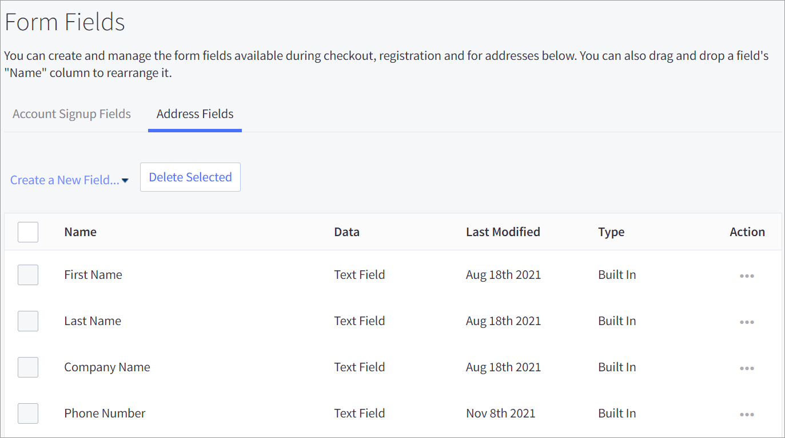
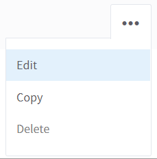
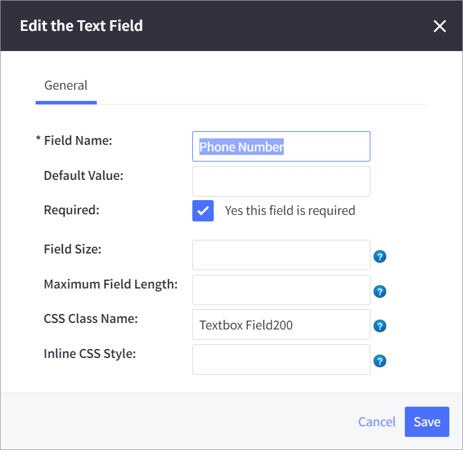

# Step 7: Edit the required phone number field


Digital River requires the phone number field. If no phone number is available, Drop-in will not display as expected.


1. Click **Settings** in the app menu on the left and then click **Account Signup Form**.&#x20;
2. Click the **Address Fields** tab.\
   &#x20;
3. Click **Edit** in the options menu.\
   &#x20;\

4. Select the **Yes this field is required** check box and click **Save**.

