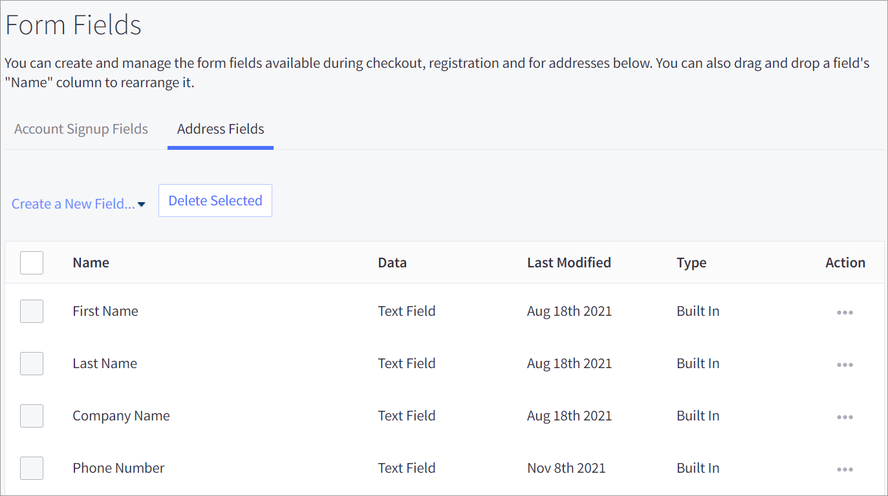
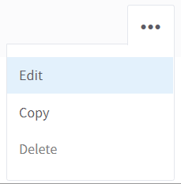
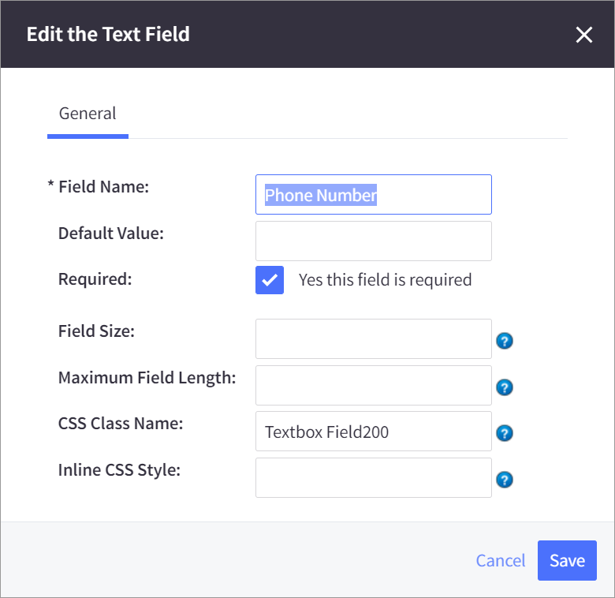

# Step 7: Edit the required phone number field

Users must provide their phone numbers during account signup to ensure seamless integration with Digital River. Making the phone number field mandatory allows you to avoid potential issues and ensure the drop-in feature operates correctly. Follow these steps to edit the required phone number field:


Digital River requires the phone number field. If no phone number is available, Drop-in will not display as expected.


1. Click **Settings** in the app menu on the left and then click **Account Signup Form**.&#x20;
2.  Click the **Address Fields** tab.\
    &#x20;

    <figure><figcaption></figcaption></figure>
3. Click **Edit** in the options menu.\
   &#x20;\

4. Select the **Yes this field is required** checkbox and click **Save**.

