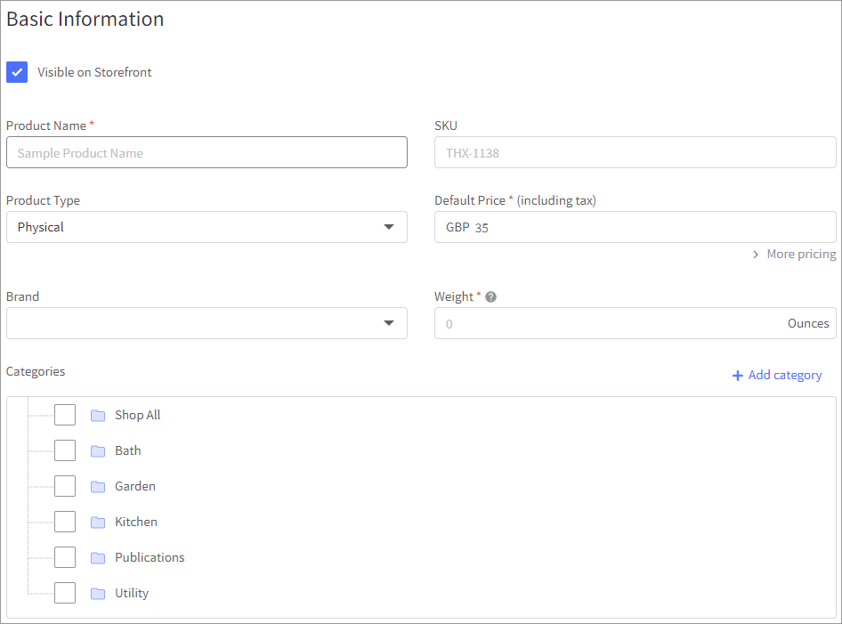

# Step 8: Configure a product

## Adding a product

You can configure the product as you normally would in BigCommerce with some exceptions. This task walks you through product requirements for Digital River.

To add a product:

1. Click **Products** in the menu on the left and then click **View**. The View Products page appears.\
   
2.  Click **Add** to create a new product.

    
3.  Under **Basic Information**, enter the values for **Product Name**, **Default Price**, and **Weight**.

    
4.  Under **Product Identifiers**, enter the values for **SKU** and the **Manufacturer Part Number (MPN)**. Your fulfillment partner can provide the manufacturer part number if you are using Digital River's Managed Fulfillment.

    
5.  Under **Pricing**, enter the default price of the product (including tax), select **Default Tax Class** from the **Tax Class** dropdown, and provide a code in the **Tax Provider Tax Code** field. See [Tax code](https://docs.digitalriver.com/digital-river-api/product-management/creating-and-updating-skus#tax-code) in [Managing SKUs](https://docs.digitalriver.com/digital-river-api/product-management/creating-and-updating-skus) for more information. ****&#x20;

    
6.  Under **Custom Fields**, click **Add Custom Fields**.

    
7.  An ECCN field is required. To create an [Export Control Classification Number (ECCN)](https://docs.digitalriver.com/digital-river-api/product-management/creating-and-updating-skus#eccn) field, enter `ECCN` in the **Custom Field Name** field and enter an [ECCN value](https://www.bis.doc.gov/index.php/licensing/commerce-control-list-classification/export-control-classification-number-eccn) in the **Custom Field Value** field.

    **Note**: In BigCommerce, you must enter the number without the decimal points.\
    .png>)
8.  A **skuGroupId** field is required if you are using the Digital River app for landed cost. To create a [SKU Group ID](https://docs.digitalriver.com/digital-river-api/product-management/creating-and-updating-skus#sku-group-identifier) field, enter `skuGroupID` in the **Custom Name** field and enter the skuGroupId value in the **Custom Field Value** field.  The `skuGroupId` uniquely identifies the [SKU group](https://www.digitalriver.com/docs/digital-river-api-reference/#tag/SKUs) associated with the SKU.  See [Grouping SKUs](https://docs.digitalriver.com/digital-river-api/product-management/setting-up-sku-groups) for more information.

    
    When updating the `skuGroupId`, you must also update or change the **Basic Product** details. When the webhook triggers, this ensures the product details are synchronized with Digital River.
    
9. In the left navigation, click **Customs Information** under **Fulfillment**.
10. Select the **Manage customs information** check box.

    
11. Select a country from the **Country of origin** dropdown.&#x20;
12. Optional. Type a brief description of the product in the **Commodity description** field.
13. Click **Save**.

## Editing an existing product

To edit an existing product:

1. Click **Products** in the menu on the left and then click **View**. The View Products page appears.
2. Choose one of the following options to edit a product:
   * Click the link under the **Product Name** column for the product you want to edit.
   * Click **More options** under the **Actions** column for the product you want to update and then click **Edit** to update a product.
3. Update the appropriate fields.
4. Click **Save**.
