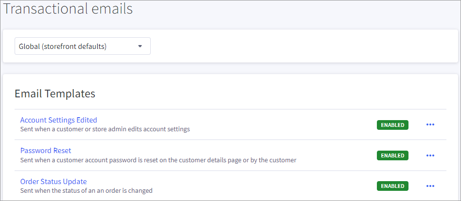
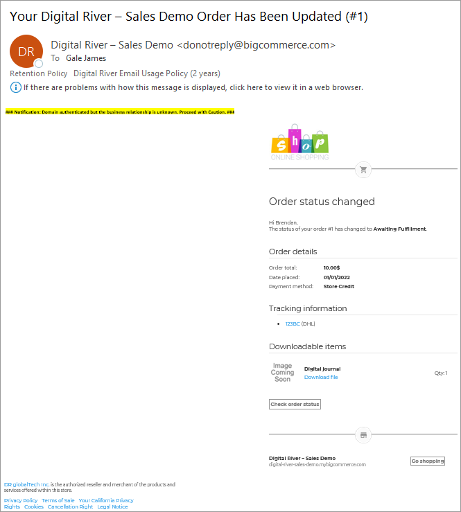
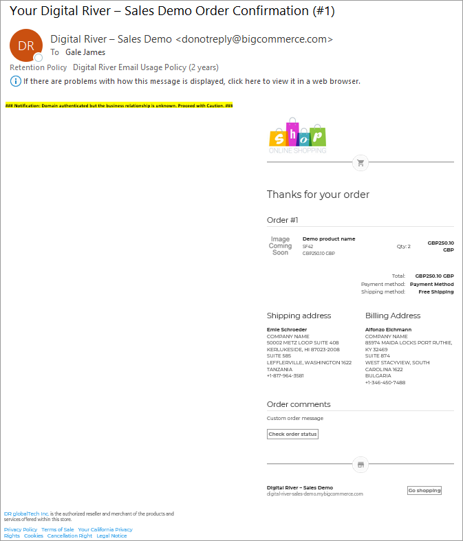
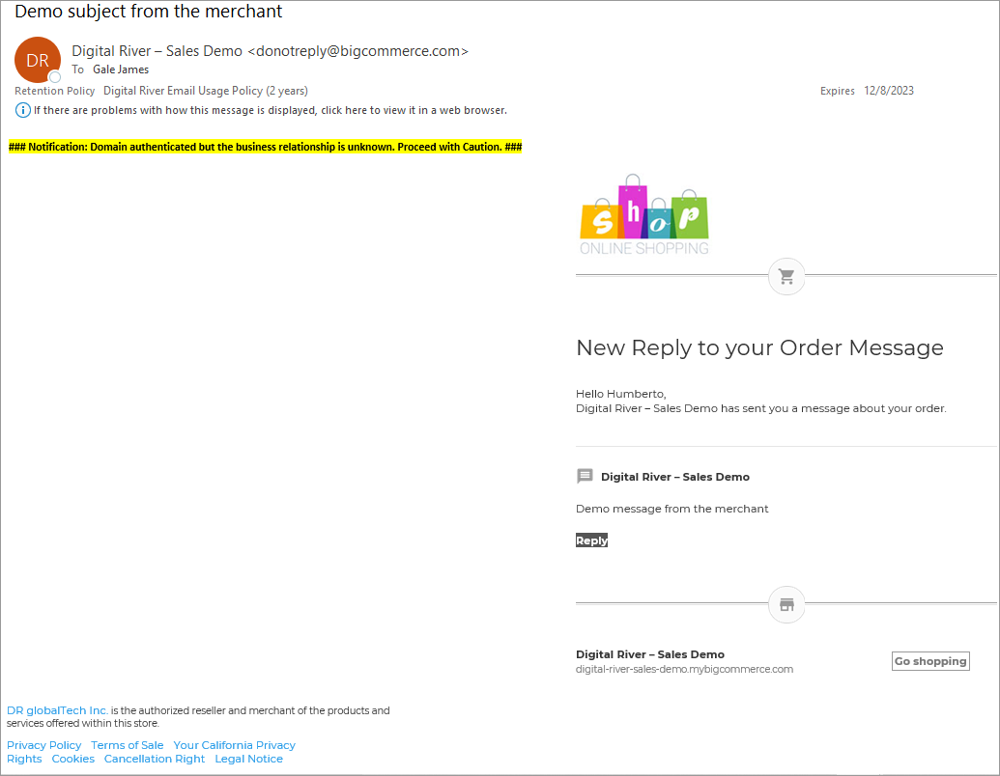

# Step 9: Configure transactional emails

The following task shows you how to create transactional email for:

* **Order Status Update**–Sent when the status of an order is changed.
* **Order Email**–Sent when an order is created.
* **Order Notification**–Sent when a shopper submits an order.

To create transactional emails:

1. Click **Marketing** in the menu on the left and then click **Transactional Emails**. The Transactional emails page appears. \
   
2. Choose one of the following transactional email options:
   * To create an order status update email, click **Order Status Update**. The Order Status Update page appears.
   * To create an order email, click **Order Email**. The Order Email page appears.
   * To create an order notification email, click **Order Notification**. The Order Notification page appears.
3. Select **Global (storefront defaults)** from the dropdown.\
   
4. Under the **Phrases** tab, add the text by locale or entity provided by your Digital River Project Manager. To add a new phrase, click **Add new** and enter a phrase name and value.
5. To apply style changes to the email, click **Code** and update the **Subject** or **Content** fields.
6. To see how the email will look when sent to a customer, click **Preview**.
7. To send a test email, click **Send a test email** and check your inbox. You will receive an email as follows:
   * Order Status Update:\
     
   * Order Email:\
     &#x20;
   * Order Notification:\
     &#x20;\

8. Click **Save**.
9. Repeat steps 2 through 8 for each additional transactional email option.
