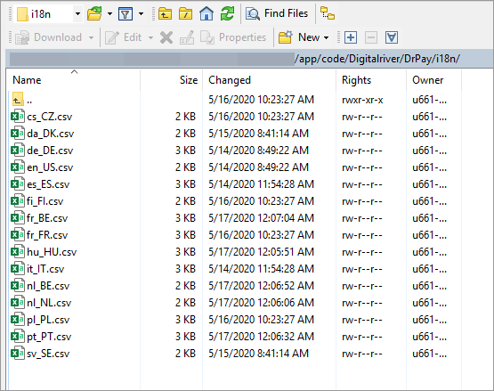

# Configuring a second website, store, or store view

You can configure the Digital River Extension for the website from the Admin Panel interface. This allows administrators to offer different payment methods and currencies for each region.

The Base Configuration locale field is the only field that changes. Digital River will provide the locale needed to meet your language, payment, and currency requirements. Payments are also configurable via [Drop-in](https://docs.digitalriver.com/digital-river-api/payments/payment-integrations-1/drop-in) by the website.

See [Set up multiple websites, stores, and store views in the Admin](https://devdocs.magento.com/guides/v2.3/config-guide/multi-site/ms\_websites.html) for additional information.

## Localization and translations

You can modify all content displayed via the Digital River Extension by adding an `/i18n` directory to the _DrPay_ folder. By default the extension supports the following languages: \[en, es, it, fr, sv, da, fi, cs, pl, hu, de, nl, pt] `/app/code/Digitalriver/DrPay/i18n`.&#x20;

After adding or updating the translation files, rerun the upgrade command:\
`$ php bin/magento setup:upgrade`


**Important**: To ensure the Magento website or store view shows the translated text, update the locale option for that website or store view via the general Magento settings. Select **Stores**, then **Configuration**, then **Genera**l, and then click **Locale Options**.

